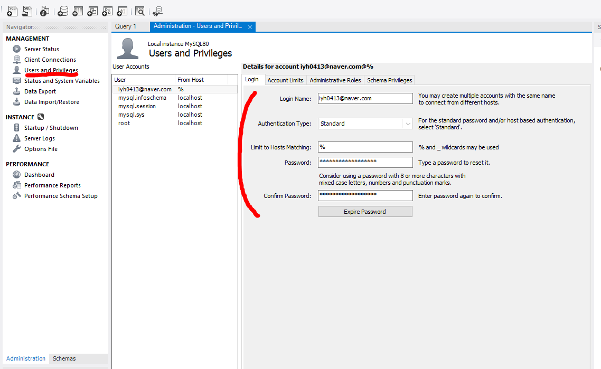
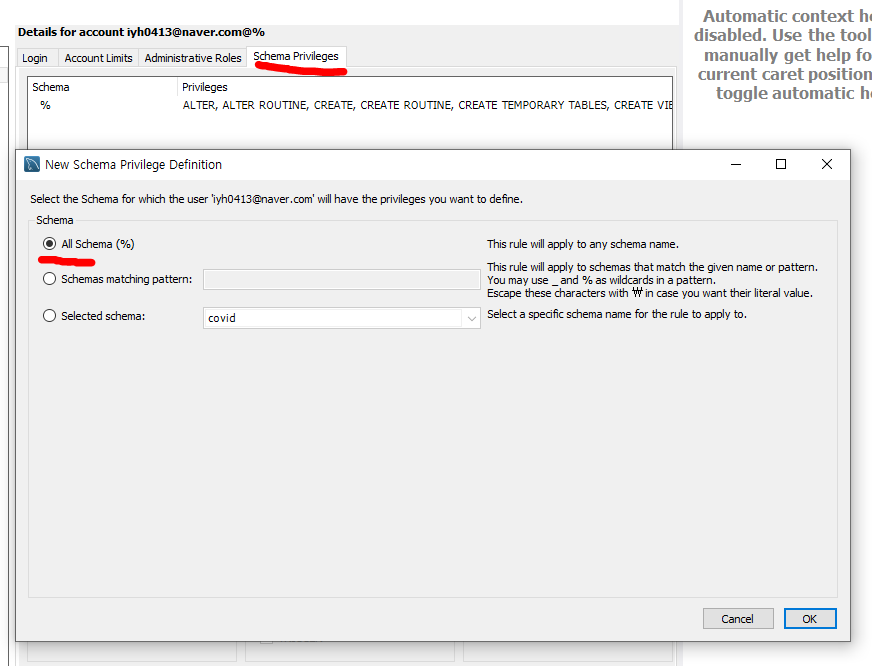
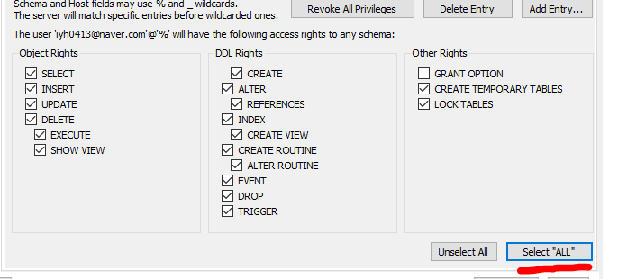
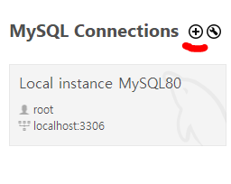
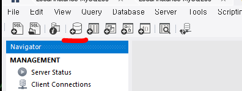
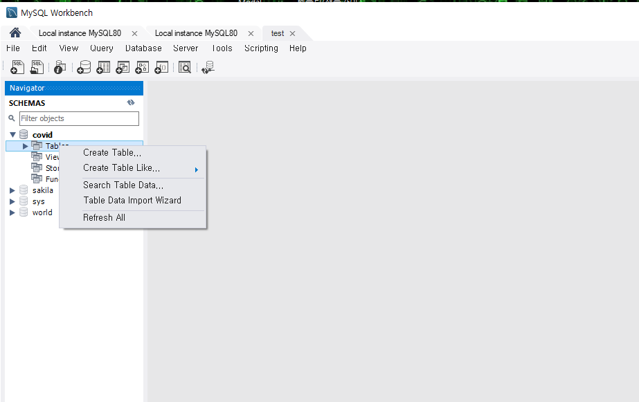
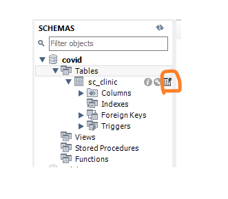
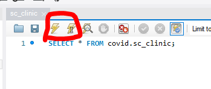
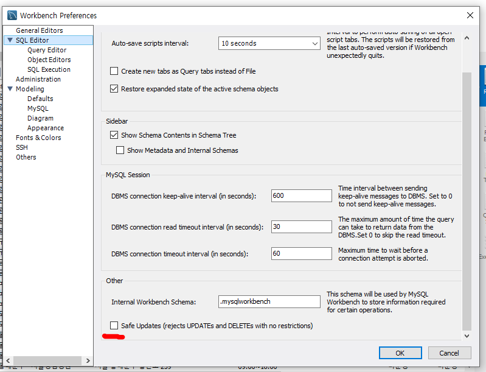
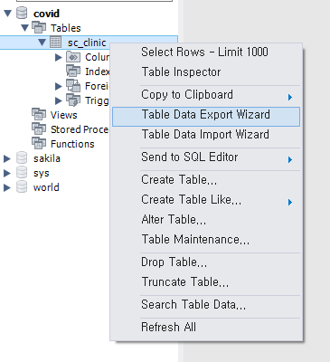

# [Mysql] Mysql 설치 후 DB 데이터 적재 및 가공 [EP 01]

## 📌 먼저 Mysql을 설치

[Mysql 설치 참고 문서](https://stricky.tistory.com/342)

Mysql 워크벤치를 사용!

## 🏓 사용자 등록

Users and Privileges에서 하단의 Add Account를 클릭

아이디, 비밀번호 적은 후 하단의 Apply를 클릭

## 👮‍♀️ 사용자에 권한 설정

Schema Privileges 클릭한다.

Add Entry를 눌러 권한을 줄 스키마를 지정한다.

스키마에 대해 줄 권한을 체크한다.(나는 모든 권한을 부여했다.)

## 🏠 해당 사용자로 진입

메인화면에서 +를 클릭한다.

해당 사용자의 유저네임으로 변경하고 연결할 이름을 지정한다.

## 📒 스키마 생성

다음 원통 모양을 클릭해 스키마를 생성한다.

원하는 이름으로 설정한다.

### csv 파일을 테이블로 import

먼저 데이터를 가져온다.

> **엑셀 데이터 가져오기**
>
> [선별 진료소 엑셀데이터 다운로드](https://www.mohw.go.kr/react/popup_200128_3.html)
>
> 1. 위 링크에서 표 우측 상단에 있는 엑셀파일 다운로드 클릭
> 2. 엑셀파일을 csv 파일로 바꿔서 저장

Mysql Workbench에서 해당 파일 데이터를 테이블로 import

해당 SCHEMA의 table을 우클릭 후 Table Data import Wizard 클릭

위에서 받아 csv 파일로 변환한 파일을 불러온다.

create new table 선택 후 테이블 name 적는다.

원하는 컬럼 선택하고 마무리 한다.

## 테이블 확인

자동으로 `SELECT * FROM covid.sc_clinic;` 쿼리를 실행

### 확인하는 아이콘 왼쪽의 수리 모양 클릭하면 테이블 수정

- 원하는 칼럼을 추가 또는 칼럼 삭제, 칼럼명 변경 및 NULL 생성

### Sql 쿼리를 이용하여 수정

- Sql 쿼리를 이용하여 reg_dt 컬럼에 등록일시
  - `UPDATE sc_clinic SET reg_dt = date_format(now(), '%y-%m-%d %h:%i:%s');`
- 수정 방법은 아래 직접 적은 쿼리 실행을 참고한다.

## 🎲 직접 적은 쿼리 실행

- 번개는 전체 쿼리 실행

- 번개 1은 선택한 쿼리 하나 실행

> **safe 모드 에러 해결 방법** 
>
> Edit - Preferences - SQL Editor의 Safe Updates 클릭 제거
>
> 
>
> 이후 서버 새로고침
>
> Query - Reconnect to Server

## 🔍 최종 테이블 데이터를 csv로 추출

해당 테이블을 우클릭 후 Table Data Export Wizard 클릭

추출할 때 추출할 이름을 입력한다.
