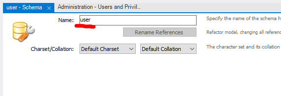
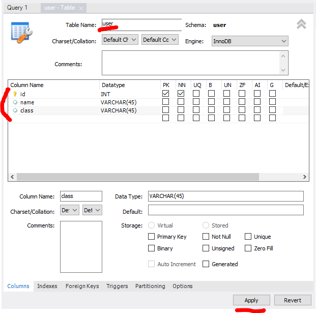
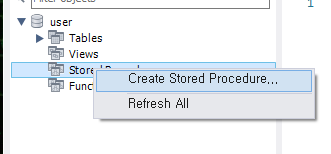
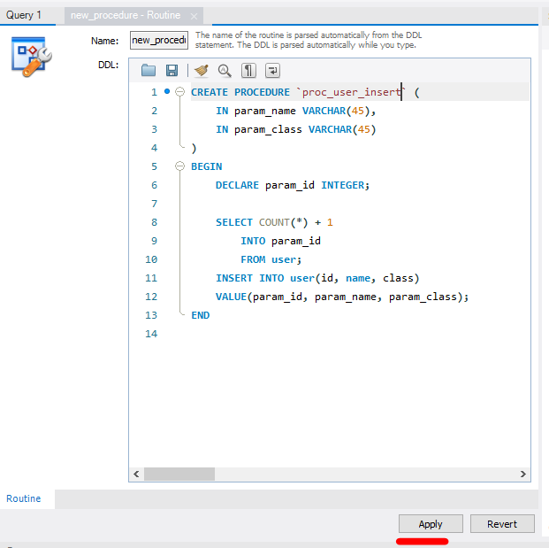
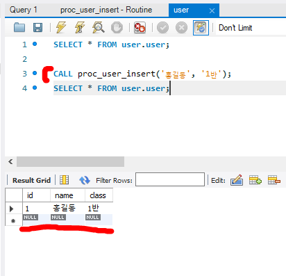

# [Mysql] Mysql 프로시저 [EP 02]

## 📚 프로시저(Procedure) 란?

여러 쿼리를 한 번에 실행하기 위해 사용한다.

### 함수와의 차이점은?

- 함수는 쿼리를 수행한 후 값을 가져오는 것이 중점 - 리턴 값이 필수이며 하나만 반환 가능
- 프로시저는 여러 쿼리를 한 번에 수행하는 것이 중점 - 리턴 값이 선택이고 여러 개 반환 가능


## 📖 실습

### 스키마 생성 

name은 user로 생성한다.



### 테이블 생성

user 테이블을 생성한다.

PK로 id를 만들고 name과 class를 정해준다.



### 프로시저 등록



프로시저 코드를 적고 등록한다.



### 프로시저 코드 설명

- 코드

```mysql
CREATE PROCEDURE `proc_user_insert` (
	IN param_name VARCHAR(45),
    IN param_class VARCHAR(45)
)
BEGIN
	DECLARE param_id INTEGER;
    
    SELECT COUNT(*) + 1
		INTO param_id
        FROM user;
	INSERT INTO user(id, name, class)
    VALUE(param_id, param_name, param_class);
END
```

먼저 입력을 IN으로 적는다. 이 때 사용자가 입력하는 값만 적는다.

id는 자동으로 만들 것이기 때문에 적지 않는다.

id는 테이블 행의 개수를 count하여 1을 더해줘 만들어준다.

그리고 INSERT INTO를 사용해서 값을 넣어주고 END로 종료한다.


### 프로시저 호출

**CALL** : 프로시저 실행 명령어

행을 추가하는 프로시저를 실행하면 아래처럼 등록된다.

