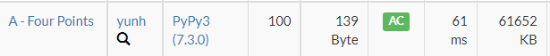

# [AtCoder] A. Four Points [Beginner Contest 246]

## 📚 문제

https://atcoder.jp/contests/abc246/tasks/abc246_a

---

## 📖 풀이

직사각형의 세 점이 주어졌을 때 나머지 한 점을 구하는 문제이다.

x 좌표가 같은 값 2개 다른 값 1개가 들어오고, y좌표도 같은 값 2개 다른 값 1개가 들어온다.

즉 xor연산자를 활용해 같은 값이 두 번 xor연산자를 거치면 1로 바뀌니 한 값만 남기게 된다.

## 📒 코드

```python
x1, y1 = map(int, input().split())
x2, y2 = map(int, input().split())
x3, y3 = map(int, input().split())
print(f'{x1^x2^x3} {y1^y2^y3}')
```

## 🔍 결과

