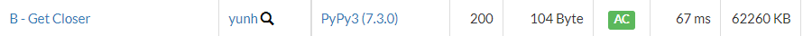

# [AtCoder] B. Get Closer [Beginner Contest 246]

## 📚 문제

https://atcoder.jp/contests/abc246/tasks/abc246_b

---

## 📖 풀이

math 문제이다. 제곱해서 더한 값이 1을 만드는 문제이다. 주어진 A, B가 두 수의 비율이니 제곱해서 더한 수의 제곱근을 A, B 각각 나눠주면 된다.

## 📒 코드

```python
a, b = map(int, input().split())
total = a ** 2 + b ** 2
print(a/(total ** (1/2)), b/(total ** (1/2)))
```

## 🔍 결과

