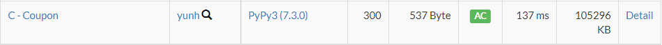

# [AtCoder] C. Coupon [Beginner Contest 246]

## 📚 문제

https://atcoder.jp/contests/abc246/tasks/abc246_c

---

## 📖 풀이

쿠폰을 최대한 효율적으로 모두 사용하는 문제이다.

처음에 heap을 이용해서 하나씩 계산하려했는데 시간초과가 발생했다.


몫과 나머지를 활용해 빠르게 구할 수 있다.

먼저 입력으로 받는 가격들의 배열을 내림차순으로 정렬한다.

큰 수부터 확인하는데 할인 금액인 x로 나눈 나머지만큼 남기고 몫만큼 할인 횟수에서 차감한다.

할인 횟수보다 나누는 몫이 더 크게 되면 이 품목에서 남은 할인만 다 해주고 종료시킨다.

모든 수를 봤는데 할인 횟수가 남았으면, 이제 다 x보다 작은 수이니 우선 내림차순으로 정렬한다.

그리고 남은 횟수만큼 큰 값을 제외하고 나머지 값들을 더한 후 출력한다.

## 📒 코드

```python
def coupon():
    global k
    if k == 0:  # 할인 횟수가 0이면 종료
        return
    for i in range(n):
        if arr[i] >= x:     # x보다 클 때, 할인해준다.
            if k < arr[i] // x:     # 남은 할인을 다 쓸 수 있을 때
                arr[i] = arr[i] - k * x
                k = 0
                return
            k -= arr[i] // x    # 할인하고 남은 할인 횟수
            arr[i] %= x     # 할인하고 남은 금액으로 변경
            if k == 0:          # 할인 횟수가 0이면 종료
                return


n, k, x = map(int, input().split())
arr = sorted(list(map(int, input().split())), reverse=True)     # 오름차순 정렬
coupon()
arr.sort(reverse=True)      # 남은 것들 재정렬
total = 0
for i in range(k, n):       # 할인하면 0이 되니까 큰 것부터 횟수만큼 제외하고 나머지를 더한다.
    total += arr[i]
print(total)
```

## 🔍 결과

