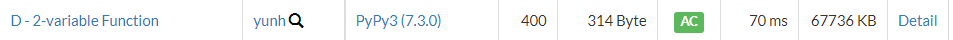

# [AtCoder] D. 2-variable Function [Beginner Contest 246]

## 📚 문제

https://atcoder.jp/contests/abc246/tasks/abc246_d

---

## 📖 풀이

문제를 처음에 보고 N의 최댓값과 문제에 대한 내용을 보고 이진탐색으로 접근했는데 해결하지 못했다.

**투포인터**로 해결하는 문제였다.

N이 크지만 a와 b의 최댓값은 10의 18제곱이 아니라 10의 6제곱보다 작거나 같다. 왜냐하면 N의 최댓값이 10의 18제곱인데 X가 10의 18제곱일 때 a는 10의 6제곱 b는 0인 경우가 가능하다. 따라서 최댓값은 10의 6제곱인 경우이다.

투포인터를 활용하기 위해 a와 b중 b를 더 큰 값으로 고정한다. 어차피 a와 b를 바꾸는 값은 동일하니 b가 더 크거나 같은 경우만 구하면 된다.

a를 0 b를 10의 6제곱으로 잡고 투포인터를 시작한다.

a와 b를 문제에 나온 연산인 ` a ** 3 + a * a * b + a * b * b + b ** 3`을 해준 결과가 n보다 크거나 같으면 b를 하나 줄이고 작으면 a를 늘린다. 이 과정을 반복하며 a가 b를 넘어가면 종료한다.

n보다 크거나 같을 때, 매번 최소값으로 갱신해준다.

## 📒 코드

```python
def f(a, b):
    return a ** 3 + a * a * b + a * b * b + b ** 3


n = int(input())
s = 0
e = 10 ** 6

min_result = 100000000000000000000
while s <= e:
    result = f(s, e)
    if result >= n:
        min_result = min(min_result, result)
        e -= 1
    else:
        s += 1

print(min_result)
```

## 🔍 결과

