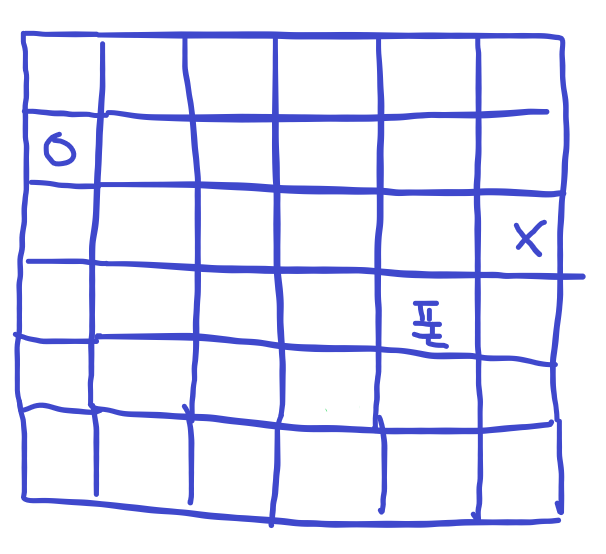
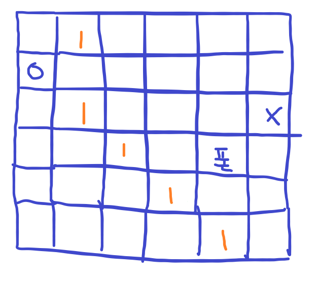
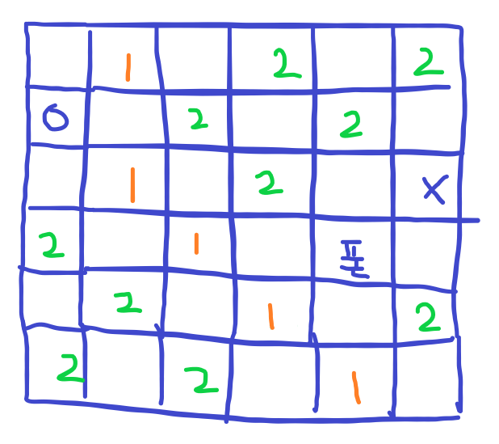
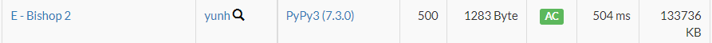

# [AtCoder] E. Bishop 2 [Beginner Contest 246]

## 📚 문제

https://atcoder.jp/contests/abc246/tasks/abc246_e

---

## 📖 풀이

**BFS 문제**이다.

비숍은 대각선 방향으로 움직인다.

입력으로 주어진 폰이 있는 위치를 움직일 수 없으니 폰을 만나면 탐색을 중단해야 한다.

그런데 그냥 BFS로 구하려고 하면 **시간초과**가 발생한다.

반복 탐색을 줄일 아이디어가 중요하다.

해결방법은 대각선 방향으로 탐색하다가 같은 level의 값이 있으면 건너뛰고 탐색하는데, 다른 level의 방문표시 값이 있으면 중단해야 한다.

왜냐면 이미 이전에 방문표시 했다는 건 그 위치를 중심으로 다시 대각선 방향으로 탐색을 한다는 것이다. 이번에도 탐색하고 그 부분에서 또 탐색하면 중복 탐색하는 것이 되므로, 중복 탐색을 제거하기 위해 현재 레벨인 경우만 건너뛰고 탐색할 수 있도록 설정하면 된다.

예제로 설명해본다.

시작점이 o이고 도착점이 x라고 하자!



---

그럼 시작점부터 대각선으로 탐색하여 1로 방문 탐색 후 큐에 담아준다. 여기까지는 일반 BFS랑 똑같다.

범위를 넘어가는 경우는 확인하지 않도록 처리해줘야한다.



---

그럼 다음 1을 기준으로 대각선 방향으로 탐색한다. 폰이 없고 이미 이전에 방문 표시했으면 건너뛴다.

대각선으로 보며 2로 적어준다. 이 때 대각선 방향으로 2보다 작은 값이 있으면 종료한다.

그러지 않으면 (2, 1)의 1과 (3, 2)의 1과 (4, 3)의 1, (5, 4)의 1이 다 오른쪽 아래 대각선과 왼쪽 위 대각선으로 전부 탐색하는 불필요한 과정이 생기게 된다. 따라서 2보다 작은 값을 발견하면 stop하게 하면 중복 확인하는 걸 줄일 수 있다.

(0, 1)이 오른쪽 대각선 아래로 2를 먼저 적어준다. (2, 1)가 오른쪽 대각선 위로 탐색할 때 2가 있으니 탐색을 종료하지 않고 건너 뛰고 그 다음에 2를 적어줘야 한다. 그러니 현재 적어줘야 할 값보다 작은 경우만 stop하고 같은 경우는 건너뛰고 계속 탐색해준다.



---

3을 넣을 때 모든 2에서 대각선 방향으로 움직이며 확인하기보단, 1,2가 없고 폰이 없는 것만 3을 확인하고 다음 정점을 확인해야 빠르게 탐색할 수 있다. (1, 4)의 2의 대각선 방향이 지금 값이 없으므로 3을 넣고 도착점에 3이 들어갔으니 종료한다.

따라서 다음 출력값은 3이다.

큐의 모든 값을 확인 후 종료했는데 도착점이 바뀌지 않았으면 -1을 출력한다.

이전의 level인지 확인하기 쉽게 방문 표시 초기값을 INF로 초기화 한다. 그러면 현재 level 이상의 값만 지속적으로 탐색하게 하면 된다. level보다 큰 값이면 종료한다.

## 📒 코드

```python
from collections import deque


def in_degree(x, y):
    return 0 <= x < n and 0 <= y < n


n = int(input())
s_x, s_y = map(lambda x: int(x) - 1, input().split())
e_x, e_y = map(lambda x: int(x) - 1, input().split())
# 폰이 있는 경우는 1, 없는 경우는 0
arr = [input() for _ in range(n)]
INF = 10000000
visited = [[INF] * n for _ in range(n)]         # 이미 그려진 걸 확인하는 과정을 생략하기 위함!!
dx = [1, 1, -1, -1]     # 대각선 방향으로 이동
dy = [1, -1, 1, -1]

que = deque()
que.append((s_x, s_y))
visited[s_x][s_y] = 0       # 비숍 방문 표시

while que:
    x, y = que.popleft()
    if x == e_x and y == e_y:
        print(visited[x][y])
        exit()
    for nxt in range(4):
        nx = x + dx[nxt]
        ny = y + dy[nxt]
        # 배열의 크기를 벗어나거나, 폰이 있거나, 그 위치부터 다른 정점이 이미 파악한 경우(중복 확인 제거)
        while in_degree(nx, ny) and arr[nx][ny] == '.' and visited[nx][ny] >= visited[x][y] + 1:
            if visited[nx][ny] == INF:        # 비숍이 없던 경우만
                visited[nx][ny] = visited[x][y] + 1         # 비숍 방문 표시
                que.append((nx, ny))
            nx += dx[nxt]
            ny += dy[nxt]

print(-1)
```

## 🔍 결과

