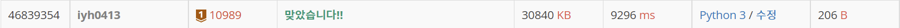

# [Baekjoon] 10989. 수 정렬하기 3 [B1]

## 📚 문제 : [수 정렬하기 3](https://www.acmicpc.net/problem/10989)

## 📖 풀이

N개의 수가 주어졌을 때 오름차순으로 정렬하여 출력하는 문제이다.

N개의 수를 배열에 담아주고 sort 함수로 정렬한다.

그리고 순차적으로 출력한다.

위와 같이 배열에 숫자를 다 담으면 메모리 초과가 발생한다.

문제를 보니 메모리를 작게 설정해두었다. 따라서 카운팅 배열을 사용해도 되고, 딕셔너리를 사용해도 된다.

n이 10000 밖에 안되니 카운팅 배열을 활용한다.

1부터 10000까지 카운팅 배열을 0으로 초기화하고 나오는 수에 해당하는 카운트를 1씩 늘려준다.

그리고 1부터 개수만큼 출력시켜주면 된다.

## 📒 코드

```python
import sys
input = sys.stdin.readline

n = int(input())
arr = [0 for _ in range(10001)]

for i in range(n):
    arr[int(input())] += 1

for i in range(1, 10001):
    for _ in range(arr[i]):
        print(i)
```

## 🔍 결과

