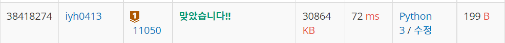

# [Baekjoon] 11050. 이항 계수 1[B1]

문제: https://www.acmicpc.net/problem/11050

---

**이항 계수**를 구하는 문제이다. <sub>N</sub>C<sub>K</sub>인데 N과 K가 10보다 작으니 그냥 곱해서 나누어서 푼다.

N!/((N-K)!*K!)를 계산한다.

먼저 <sub>N</sub>C<sub>K</sub> = <sub>N</sub>C<sub>N-K</sub> 를 활용해 바꾼다.

N부터 N-K+1까지 수를 곱해 1부터 K까지 수를 곱한 수와 나눈다.

---

코드:

```python
N, K = map(int, input().split())

if N-K < K:
    K = N-K

up_nums = 1
down_nums = 1

for i in range(N,N-K,-1):
    up_nums *= i

for i in range(1,K+1):
    down_nums *= i

print(up_nums//down_nums)

```

---

결과:

