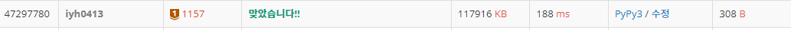

# [Baekjoon] 1157. 단어 공부 [B1]

## 📚 문제 : [단어 공부](https://www.acmicpc.net/problem/1157)

## 📖 풀이

알파벳을 순회하면서 딕셔너리에 담아준다.

다 담았으면 딕셔너리를 리스트로 바꿔주고 개수가 가장 큰 순서대로 정렬하여 많이 사용된 알파벳을 출력한다.

0번째 인덱스와 1번째 인덱스 값의 개수가 같다면 ?를 출력한다.

대문자와 소문자를 같게 처리해야 한다. 같게 처리하기 위해 ord()와 chr()을 사용해 아스키코드 값을 소문자를 대문자로 바꿔준다.

## 📒 코드

```python
message = input()
dic = {}
for c in message:
    if c >= 'a':
        c = chr(ord(c) - ord('a') + ord('A'))
    dic[c] = dic.get(c, 0) + 1

arr = []
for k, v in dic.items():
    arr.append([v, k])

arr.sort(reverse=True)

if len(arr) > 1 and arr[0][0] == arr[1][0]:
    print("?")
else:
    print(arr[0][1])

```

## 🔍 결과

