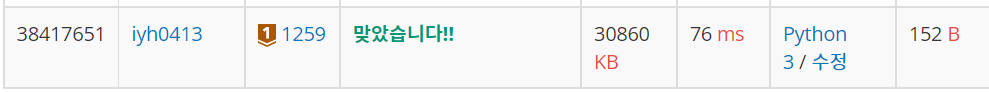

# [Baekjoon] 1259. 팰린드롬수[B1]

문제: https://www.acmicpc.net/problem/1259

---

팰린드롬수는 흔히 회문으로 알고있던 것이다.

예전 SWEA 기초 연습문제를 풀 때 풀어봤던건데 슬라이싱에서 `[::-1]`을 사용하면 뒤집어지는 걸 이용해서 해결한다.

하나씩 입력을 받아서 0이면 while문을 종료시키고 0이 아니면 `num[::-1] == num`이 True일 때 'yes'를 출력하고 아니면 'no'를 출력한다.

코드:

```python
while True:
    num = input()
    if num == '0':
        break
    else:
        if num[::-1] == num:
            print('yes')
        else: print('no')
```

결과:



