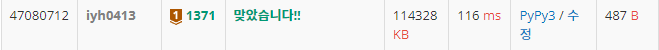

# [Baekjoon] 1371. 가장 많은 글자 [B1]

## 📚 문제 : [가장 많은 글자](https://www.acmicpc.net/problem/1371)

## 📖 풀이

공백 문자는 if문에 통과시키면 True로 반환되는지 알고있어 해결하는데 오래걸렸다..

입력의 끝을 모르는 문제여서 EOFError를 이용해야 한다.

try except로 EOFError가 발생한 경우 끝을 낸다.

가장 많은 글자를 넣어주기 위해 딕셔너리를 활용한다.

카운팅 배열을 활용하기보다는 딕셔너리를 활용하는게 편해 딕셔너리를 활용한다.

내림차순으로 정렬시킨 후 가장 많은 글자를 내림차순으로 출력한다.

## 📒 코드

```python
dic = {}

while True:
    try:
        for c in input():
            if c != ' ':
                dic[c] = dic.get(c, 0) + 1 
    except EOFError:
        arr = []
        for c, num in dic.items():
            arr.append([c, num])
        arr.sort(key=lambda x: (-x[1], x[0]))
        max_val = arr[0][1]
        result = ''
        for c, num in arr:
            if num == max_val:
                result += c
            else:
                break
        print(result)
        break
```

## 🔍 결과

