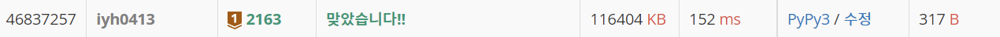

# [Baekjoon] 2163. 초콜릿 자르기 [B1]

## 📚 문제 : [초콜릿 자르기](https://www.acmicpc.net/problem/2163)

## 📖 풀이

가로와 세로 중 변의 길이가 더 큰 쪽으로 쪼갠다.

재귀함수를 활용해 반복한다.

최대한 중앙에 가까운 금을 쪼갠다. 쪼갤 때 2로 나눈 몫을 기준으로 나눠준다.

예를 들어, 5인 경우는 2, 3으로 쪼갠다.

## 📒 코드

```python
def recur(x, y):
    if x == 1 or y == 1:
        return x + y - 2
    if x <= y:
        a = y // 2
        b = y - a
        return recur(x, a) + recur(x, b) + 1
    else:
        a = x // 2
        b = x - a
        return recur(a, y) + recur(b, y) + 1
        

n, m = map(int, input().split())
print(recur(n, m))
```

## 🔍 결과



