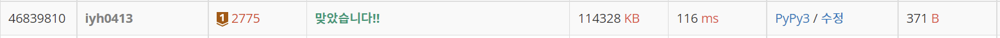

# [Baekjoon] 2775. 부녀회장이 될테야 [B1]

## 📚 문제 : [부녀회장이 될테야](https://www.acmicpc.net/problem/2775)

## 📖 풀이

0층에 각 호에는 1호에는 1명, 2호에는 2명, 3호에는 3명이 산다. 1층을 보면 1층의 1호에는 1명, 2호에는 1 + 2 = 3명, 3호에는 1 + 2 + 3 = 6명이다.

위와 같은 규칙을 가지고 k층 n호에 몇 명이 살고 있는지 출력해야 하는데 여러 케이스가 있으니 DP에 저장하며 해결해본다.

탑다운 DP를 활용해 해결한다.

## 📒 코드

```python
def recur(floor, ho):
    if dp[floor][ho]:
        return dp[floor][ho]
    
    ans = 0
    for i in range(1, ho + 1):
        ans += recur(floor - 1, i)
    dp[floor][ho] = ans
    return ans

dp = [[0 for _ in range(15)] for _ in range(15)]
dp[0] = [i for i in range(15)]

for _ in range(int(input())):
    k = int(input())
    n = int(input())
    print(recur(k, n))
```

## 🔍 결과

