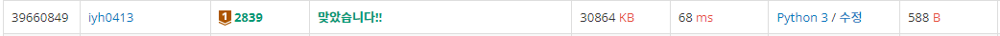
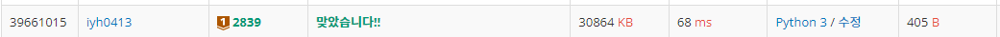

# [Baekjoon] 2839. 설탕 배달 [B1]

## 📚 문제

https://www.acmicpc.net/problem/2839

---

5개를 담을 수 있는 봉지와 3개를 담을 수 있는 봉지가 있을 때 주어진 N개를 가장 적게 담을 수 있는 봉지의 수를 구하는 문제이다.

3개를 담을 수 있는 봉지를 0개부터 하나씩 증가시켜가며 5개를 담을 수 있는 봉지를 0~N개만큼 증가시켜가며 세어 보았다.

## 📒 코드

```python
def bongji(N):  # 최소로 가져갈 수 있는 봉지의 수
    cnt3 = 0    # 3개를 담는 봉지의 수
    cnt5 = 0    # 5개를 담는 봉지의 수
    for i in range(0, N + 1, 3):             # 3개를 담는 봉지를 0개부터 증가
        for j in range(0, N + 1 - i, 5):     # 5개를 담는 봉지를 총 설탕의 개수가 N 이하일 때까지 확인
            if N == i + j:                  # 봉지에 다 담기면 return
                return(cnt3 + cnt5)
            cnt5 += 1
        cnt5 = 0
        cnt3 += 1
    return(-1)


print(bongji(int(input())))
```

## 🔍 결과



---

좀 더 효율적으로 구하는 방법을 생각해보았다.

3개를 담는 봉지를 0부터 증가시켜가며 남은 것들이 5로 나누어떨어지는지로 확인한다.

## 📒 코드

```python
def bongji(N):  # 최소로 가져갈 수 있는 봉지의 수
    cnt = 0    # 봉지의 수
    for i in range(0, N + 1, 3):            # 3개를 담는 봉지를 0개부터 증가
        if (N - i) % 5 == 0:                # 5개로 나누어떨어지는지 확인
            return cnt + ((N - i) // 5)       # 3개를 담은 봉지 + 5개를 담은 봉지
        cnt += 1    # 3개를 담을 때마다 1 증가
    return -1


print(bongji(int(input())))
```

## 🔍 결과



예상과는 다르게 결과는 같다 😅