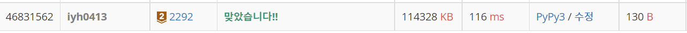

# [Baekjoon] 2292. 벌집 [B2]

## 📚 문제 : [벌집](https://www.acmicpc.net/problem/2292)

## 📖 풀이

처음에는 1이다.

거리가 2인 수들은 2 ~ 7이다.

거리가 3인 수들은 8 ~ 19이다.

거리가 4인 수들은 20 ~ 37이다.

2 ~ 7은 6개

8 ~ 19는 12개

20 ~ 37은 18개이다.

따라서 1부터 6의 배수를 더해가며 거리를 1씩 늘려나간다.

이 수가 n보다 커질 때 그 때의 거리 값을 출력한다.

## 📒 코드

```python
n = int(input())

dist = 1
cnt = 1
for i in range(1, n):
    if n <= cnt:
        break
    cnt += i * 6
    dist += 1
print(dist)
```

## 🔍 결과

