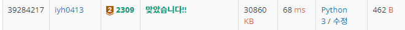

# [Baekjoon] 2309. 일곱 난쟁이 [B2]

## 📚 문제

https://www.acmicpc.net/problem/2309

---

**투포인터** 문제이다.

9명 중 일곱난쟁이가 아닌 일정 조건을 만족시키는 스파이 2명을 찾는 문제이니 투포인터를 활용한다.

모든 사람 키의 합을 구하고 일곱난쟁이 키의 합인 100을 빼서 스파이의 몸무게 합을 찾는다.

두 수의 합을 하니 전체를 정렬시키고 찾아야한다.

정렬시키기 위해 `sort()` 대신 **버블정렬**을 구현해보았다.

길이가 9 밖에 안되니 시간초과 걱정은 없다.

두 수를 정렬한 배열의 양 끝에 배치한 후 두 수의 합이 원하는 값과 일치하면 스파이들을 제거하고 나머지 난쟁이들을 출력한다.

두 수의 합이 더 크면 e를 왼쪽으로 옮겨 두 수의 합을 줄인다.

두 수의 합이 더 작으면 s를 오른쪽으로 옮겨 두수의 합을 키운다.

## 📒 코드

```python
arr = [int(input()) for _ in range(9)]

# 오름차순 버블 정렬, 9개 뿐이니 버블정렬을 사용한다.
for i in range(8):
    for j in range(8-i):
        if arr[j] > arr[j+1]:
            arr[j], arr[j+1] = arr[j+1], arr[j]

ssum = 0
for i in range(9):
    ssum += arr[i]

ssum -= 100     # 합에서 100을 빼 스파이 2명 키의 합으로 바꿔준다.
s = 0
e = 8
while s != e:   # 스파이 2명을 찾아야하므로 투포인터를 사용한다.
    if arr[s] + arr[e] == ssum: # 스파이를 찾으면 종료
        del arr[e], arr[s]  # e와 s에 해당하는 스파이 제거
        break
    elif arr[s] + arr[e] > ssum:
        e -= 1
    else:
        s += 1

for i in range(7):  # 스파이를 뺀 일곱난쟁이 출력
    print(arr[i])
```

## 🔍 결과

