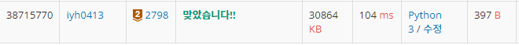

# [Baekjoon] 2798. 블랙잭 [B2]

## 📚 문제

https://www.acmicpc.net/problem/2798

---

N개의 카드들 중 3개를 더한 합이 주어진 숫자인 M보다 크지않은 가장 경우를 찾아야 하는 문제이다.

**완전 탐색**으로 해결한다. 3개를 뽑는 경우이니까 **조합**이다.

전에 **재귀**로 조합 문제를 해결했을 때처럼 하면 속도가 많이 느리니 **for문**을 활용한다.

따라서 for문을 3번 돌면서 순차적으로 뽑는다.

## 📒 코드

```python
N, M = map(int, input().split())
lst = list(map(int,input().split()))    # 카드들을 리스트에 담는다.

sum = 0 # 3개를 더한 sum
result = 0  # 조건을 만족시키는 가장 큰 sum을 담을 result 값 

for i in range(N):  # 조합이니 for문을 통과하면 똑같은 걸 반복하지 않게 범위를 지정해준다.
    sum = lst[i]
    for j in range(i+1,N):
        if sum + lst[j] < M:    # 2개를 더한 순간, M보다 같거나 커지면 다시 두번째 숫자를 고른다.
            sum += lst[j]
        else: continue
        for k in range(j+1,N):
            if sum + lst[k] <= M and result < sum + lst[k]: # 3개를 더한 값이 M보다 작거나 같고 result보다 크면 result를 변경
                result = sum + lst[k]
        sum -= lst[j]   # 2번째 숫자를 변경할 때 그 전에 더해준 값을 다시 빼준다.

print(result)
```

## 🔍 결과

