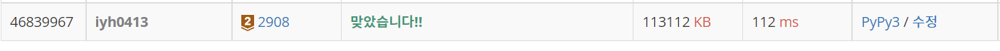

# [Baekjoon] 2908. 상수 [B2]

## 📚 문제 : [상수](https://www.acmicpc.net/problem/2908)

## 📖 풀이

상수는 수를 거꾸로 읽는다. 따라서 두 수를 거꾸로 바꾼 후 큰 수를 출력한다.

먼저 입력을 정수형으로 바꾸지 않고 문자열로 받는다. 그리고 뒤집는다.

다시 정수형으로 바꿔 크기를 비교한 후 큰 수를 출력하면 된다.

## 📒 코드

```python
a, b = input().split()
a = a[::-1]
b = b[::-1]
a = int(a)
b = int(b)
if a <= b:
    print(b)
else:
    print(a)
```

## 🔍 결과

