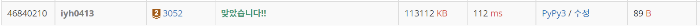

# [Baekjoon] 3052. 나머지 [B2]

## 📚 문제 : [나머지](https://www.acmicpc.net/problem/3052)

## 📖 풀이

수를 10개 받아 42로 나눈 나머지를 %(모듈러 연산)으로 구한다.

그 결과 값을 set() 자료형에 저장한다.

그러면 중복이 제거되니 서로 다른 값이 몇 개가 있는지 카운팅 하기 쉽다.

다 저장한 후 세트의 길이를 출력하기만 하면 된다.

## 📒 코드

```python
result = set()

for i in range(10):
    result.add(int(input()) % 42)

print(len(result))
```

## 🔍 결과

