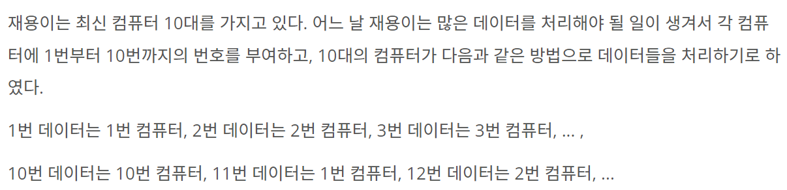
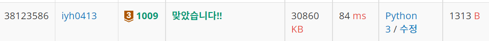

# [Baekjoon] 1009. 분산처리[B3]

## 📚 문제

https://www.acmicpc.net/problem/1009

## 📒 1차 코드

```python
T = int(input())    # 테스트 케이스 개수 T
a_b_lst = []    # a,b를 리스트에 담을 빈 배열
for i in range(T):  # [a,b]를 담은 2차원 리스트를 만든다.
    a_b_lst.append(list(map(int,input().split())))

def last_num(a, b): # 마지막 숫자를 수행해주는 프로그램
    result = a  # 한번 곱할 때마다 바꿔줄 1의 자리 수
    for _ in range(b-1):    # b-1번 a를 곱해주며 % 연산자를 사용해 1의 자리만 남긴다
        result = (result * a) % 10
    return result

for i in range(T):  # [a,b] 가 T개 있으니 for문으로 순회
    print(last_num(*a_b_lst[i]))    # 입력받은 [a,b]리스트를 언팩 연산자를 활용해 입력으로 넣어 실행한다.
```

처음 풀었던 답이다. 곱하는 수가 너무 길어서 바로 시간 초과..

그리고 나중에 수정할 때 보니 **result가 0일 때 10으로 바꿔줘야 한다!**



>  0~10번 컴퓨터가 아니라 1~10번 컴퓨터

일일이 다 나누는게 아니라 **반복되는 규칙**을 이용한다.

밑은 일단 **1~99**까지 입력으로 들어오는데 1의 자리 아니면 필요없으니 10으로 나눈 나머지로 남긴다.

지수는 밑의 숫자에 따라 반복되니 반복되는 규칙을 생각해본다.

> 0 : 0
> 1 : 1
> 2 : 2 4 8 6
> 3 : 3 9 7 1
> 4 : 4 6
> 5 : 5
> 6 : 6
> 7 : 7 9 3 1
> 8 : 8 4 2 6
> 9 : 9 1

다음과 같이 반복되므로 1,2,4의 최소공배수인 100이상의 자릿수는 없애버려도 된다.

따라서 들어오는 수를 100으로 나눈 나머지로 두자리 이하의 수로 남긴다.

그리고 밑에 맞추어 4,2로 나눈 나머지로 값을 찾고, 하나로 반복되는 수는 그대로 출력한다.

## 📒 최종 코드

```python
T = int(input())    # 테스트 케이스 개수 T
a_b_lst = []    # a,b를 리스트에 담을 빈 배열
for i in range(T):  # [a,b]를 담은 2차원 리스트를 만든다.
    a_b_lst.append(list(map(int,input().split())))


def last_num(a, b): # 마지막 숫자를 수행해주는 프로그램
    result = 1  # 한번 곱할 때마다 바꿔줄 1의 자리 수
    small_a = a % 10    # a가 두 자리까지 들어오니 1의자리 남기고 버린다
    small_b = b % 100 # b의 수를 줄인다. 4의배수, 2의배수, 1의배수로 반복되니 100으로 우선 나눈다.
    if small_a in [0, 1, 5, 6]: # 0,1,5,6은 몇 번 곱해도 그대로니 그대로 출력
        if small_a == 0: print(10)  # 0이 나오면 10번째 컴퓨터가 이용하는거니까 10을 더한다.
        else: print(small_a)
        return
    elif small_a in [2, 3, 7, 8]: 
        small_b = b % 4   # 2,3,7,8은 4개 씩 반복되니 4로 나눈 나머지로 줄인다.
        if small_b == 0: small_b = 4
    else: 
        small_b = b % 2   # 4, 9는 2개 씩 반복되니 2로 나눈 나머지로 줄인다.
        if small_b == 0: small_b = 2
    result = (small_a**small_b) % 10
    if result == 0: print(10)
    else: print(result)

for i in range(T):  # [a,b] 가 T개 있으니 for문으로 순회
    last_num(*a_b_lst[i])    # 입력받은 [a,b]리스트를 언팩 연산자를 활용해 입력으로 넣어 실행한다.
```

## 🔍 결과

