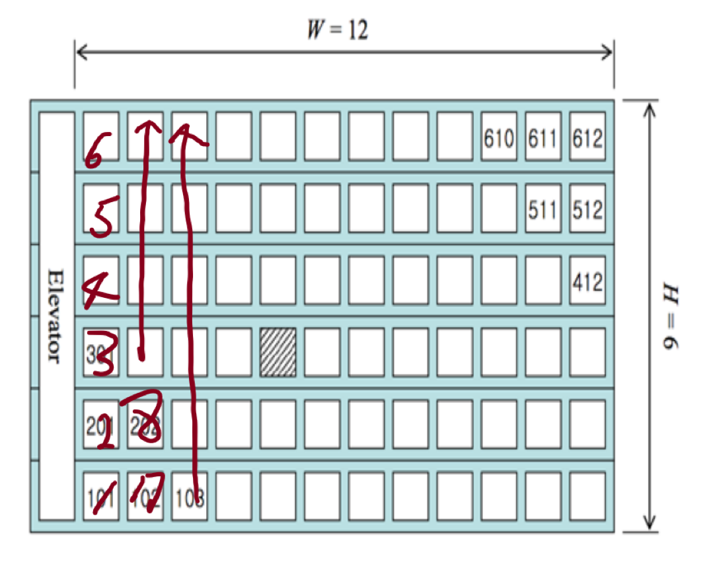
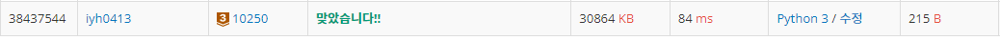

# [Baekjoon] 10250. ACM 호텔[B3]

## 📚 문제

https://www.acmicpc.net/problem/10250

---

문제에서 필요한 정보:

> 1. 호텔 정문으로부터 걸어서 가장 짧은 거리에 있는 방을 선호
>
> 2. 엘레베이터 1층에 정문
>
> 3. 방 번호는 YXX 나 YYXX 형태인데 여기서 Y 나 YY 는 층 수를 나타내고 XX 는 엘리베이터에서부터 세었을 때의 번호를 나타낸다. 
>
> 4. 걷는 거리가 같을 때에는 아래층의 방을 더 선호한다

그림으로 표현해본다.



엘레베이터에서 가까운 호수가 작은 수부터 채우는데 층이 낮은 것부터 채워나간다.

## 📒 코드

```python
T = int(input())

for _ in range(T):
    H, W, N = map(int,input().split())
    floor = ((N-1) % H) + 1 # 층이 낮은 것부터 채운다.
    ho = (N-1) // H + 1 # 호수가 작은 것부터 채운다.
    if ho // 10:
        print(f'{floor}{ho}')
    else:   # 호수가 10보다 작으면 0을 중간에 삽입한다.
        print(f'{floor}0{ho}')
```

## 🔍 결과

