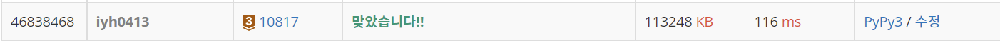

# [Baekjoon] 10817. 세 수 [B3]

## 📚 문제 : [세 수](https://www.acmicpc.net/problem/10817)

## 📖 풀이

두 번째로 큰 정수를 출력해야 한다.

입력받은 세 정수를 리스트에 담고 정렬한 후 두 번째 값을 출력한다.

## 📒 코드

```python
arr = list(map(int, input().split()))
arr.sort()
print(arr[1])
```

## 🔍 결과

