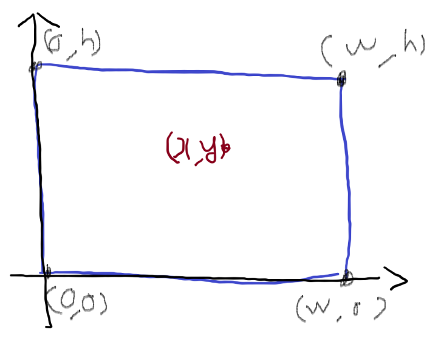

# [Baekjoon] 1085. 직사각형에서 탈출[B3]

## 📚 문제

https://www.acmicpc.net/problem/1085

---



다음과 같은 직사각형에서 x,y가 직사각형의 경계선까지 가는 거리의 최솟값을 구해야 한다.

각 직사각형의 변까지의 거리인 x, w-x, y, h-y 중 최솟값을 출력한다.

min()함수를 쓰는 대신 x, w-x, y, h-y를 리스트에 담은 후 for문을 돌며 최솟값을 담아 출력한다.

## 📒 코드

```python
x, y, w, h = map(int, input().split())
lst_distance = [x, y, w-x, h-y] # 직사각형의 각 변까지의 최소 거리 값
min_distance = lst_distance[0]   # 가장 작은 값 초기화
for distance in lst_distance:   # min함수 대신 직접 만든다.
    if min_distance > distance:
        min_distance = distance
print(min_distance)
```

## 🔍 결과

