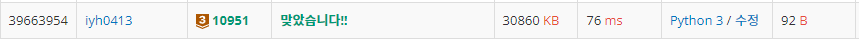

# [Baekjoon] 10951. A+B - 4 [B3]

## 📚 문제

https://www.acmicpc.net/problem/10951

---

종료 조건이 없는 문제..

while문으로 종료조건 없이 계속 반복시켜준다.

## 📒 코드

```python
while True:
    print(sum(map(int, input().split())))
```

## 🔍 결과 - 런타임 에러


---

---

while문으로 계속 반복해주고 try catch를 활용해 종료시켜준다..

## 📒 코드

```python
while True:
    try:
        print(sum(map(int, input().split())))
    except:
        break
```

## 🔍 결과



파이썬은 종료조건 없는 문제는 try catch를 활용해 종료시킨다!