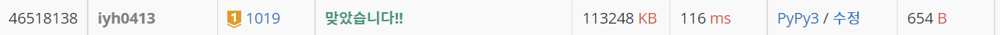

# [Baekjoon] 책 페이지 [G1]

## 📚 문제 : [책 페이지](https://www.acmicpc.net/problem/1019)

## 📖 풀이

n이 10억으로 주어지니 O(n)으로는 해결이 불가능하다.

게다가 페이지 1부터 페이지 숫자 하나씩 확인하면서 나가려면 O(n^2)이라 다른 방법이 필요하다.

n의 1의 자리의 개수부터 각 자리 수의 개수를 순서대로 찾아준다.

이 때 계산하기 편하게 하기 위해 1의 자리 수를 9가 되게 수를 줄여준다.

예를 들어 n이 1234라고 하자.

그럼 1의 자리의 개수를 먼저 세야 한다. 쉽게 구하기 위해 1의 자리가 9가 될 때까지 줄여준다. 그러면 1229가 된다.

1229의 0부터 9까지 들어올 수 있는 개수가 122개이다.

따라서 1234, 1233, 1232, 1231, 1230까지의 각 자리의 개수는 따로 더해주고, 9로만 맞춰 계산할 수 있다.

계산이 끝났으면 1229의 1의 자리를 뺀다. 그러면 122가 된다.

여기서 또 9로 끝나게 수를 줄여주길 반복한다.

수가 다 없어질 때까지 반복한다.

page가 0일 때는 제외시켜줘야 하니 0일 때 제외시켜주는 코드 하나 추가해줘야 정상적으로 값이 출력된다.

## 📒 코드

```python
def reduce(num, digit):          # 일의 자리가 9가 될 때까지 줄이면서 각 자리 개수를 구해준다.
    if num % 10 == 9 or not num:            # 9를 만들고 0이면 종료
        return num
         
    for c in str(num):                      # 수를 만들면서 나오는 자리 개수를 더해준다.
        visited[int(c)] += digit
    num = reduce(num - 1, digit)
    return num

def page(num, digit):       # 현재 구할 수와 자릿 수
    num = reduce(num, digit)
    if not num:             # 0이면 종료
        return
    num //= 10
    cnt = num + 1
    for i in range(10):
        if i == 0:          # page가 0일 때는 제외
            visited[i] -= digit
        visited[i] += digit * cnt
    page(num, digit * 10)


n = int(input())
visited = [0 for _ in range(10)]
page(n, 1)
print(*visited)
```

## 🔍 결과


