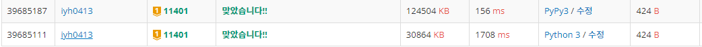

# [Baekjoon] 이항 계수 3 [G1]

## 📚 문제

https://www.acmicpc.net/problem/11401

---

모듈러의 성질을 이용하기 위해서는 다 곱으로 이루어져 있어야 하는데 이항 계수는 나누어져있다. 따라서 모듈러의 역원을 페르마의 소정리를 이용해 곱셈으로 바꿔 계산한다.

나누는 수가 K보다 크니 페르마의 소정리를 사용가능하다!!

>1. N! / (N-K)! 을 우선적으로 계산해준다.
>
>2. 페르마의 소정리를 이용해 1/K!를 (K!)^(M-2)로 변환한다.
>
>3. 지수 계산을 하기 위해 분할정복을 이용한 거듭제곱을 활용한다.

모듈러의 성질을 이용하기 위해 다 곱으로 이루어져있으니 계산과정마다 modular 연산을 해준다.

## 📒 코드

```python
N, K = map(int, input().split())
M = 1_000_000_007
result = 1

for i in range(N-K+1, N+1):         # N! / (N-K)!의 mod 구하기
    result = (result * (i % M)) % M
result1 = 1
for i in range(1, K+1):             # K!의 mod 값 구하기
    result1 = (result1 * (i % M)) % M

# 1/K!의 mod 값은 (K!)^(M-2)의 mod 값이랑 같다.
# 분할정복으로 n의 m 거듭제곱 값 구하기
def pows(n,m):                      
   
    if m == 0:
        return 1
    
    ret = pows(n,m//2)      # 재귀를 활용하여 거듭제곱의 연산과정을 줄인다.
    ret *= ret
    ret %= M                # 나머지 값만 구하면 되니 연산 과정마다 나누어 준다.

    if m % 2 == 0:
        return ret
    else:
        return (ret * n) % M

print((result * pows(result1, M-2)) % M)
```

## 🔍 결과



pypy랑 python이랑 같은 코드인데 속도차이가 많이 난다.