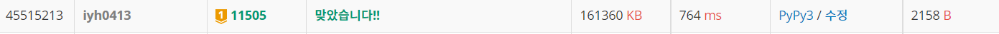

# [Baekjoon] 11505. 구간 곱 구하기 [G1]

## 📚 문제 : [구간 곱 구하기](https://www.acmicpc.net/problem/11505)

## 📖 풀이

저번 구간 합 구하기 문제와 같은 **세그먼트 트리**를 이용한 문제이다.

세그먼트 트리 복습 겸 풀어보았다.

세그먼트 트리를 업데이트하는 과정이 달라 시간이 오래 걸렸다.

구간 합 구하기에서는 범위 안에 있는 경우 더해주기만 하면 끝이었는데, 여기서는 범위 안에 있는 경우 구간을 나눠 구한 값을 변경시켜주는 작업이 필요하다.

## 📒 코드

```python
import sys
input = sys.stdin.readline


def seg_init(s, e, node):                       # 세그먼트 트리 초기 설정
    if s == e:
        tree[node] = arr[s]
    else:
        mid = (s + e) // 2
        left = seg_init(s, mid, node * 2)                   # 왼쪽과 오른쪽으로 나눈다.
        right = seg_init(mid + 1, e, node * 2 + 1)
        tree[node] = (left * right) % mod_val
    return tree[node]


def seg_update(s, e, node):                     # 세그먼트 트리 업데이트
    if not(s <= target <= e):                   # 범위를 만족하지 않을 때
        return
    if s == e:
        tree[node] = arr[s]
        return
    else:
        mid = (s + e) // 2
        seg_update(s, mid, node * 2)                   # 왼쪽과 오른쪽으로 나눈다.
        seg_update(mid + 1, e, node * 2 + 1)
        tree[node] = (tree[node * 2] * tree[node * 2 + 1]) % mod_val


def seg_print(s, e, node):              # 구간 곱 출력
    if left <= s and right >= e:        # 포함하는 수일 때
        return tree[node]
    elif e < left or s > right:         # 포함하지 않는 경우
        return 1
    else:                               # 걸치는 경우
        mid = (s + e) // 2
        return (seg_print(s, mid, node * 2) * seg_print(mid + 1 , e, node * 2 + 1)) % mod_val     


n, m, k = map(int, input().split())
arr = [0 for _ in range(n + 1)]
for i in range(1, n + 1):                       # 입력이 1부터 n 인덱스로 들어온다.
    arr[i] = int(input())

mod_val = 1_000_000_007                         # m으로 나눈 나머지를 출력
tree = [0 for _ in range(n * 4)]           # [구간의 곱(0을 제외한), 0의 개수]으로 세그먼트 트리에 담아줄 것이다.
seg_init(1, n, 1)

for i in range(m + k):
    a, b, c = map(int, input().split())
    if a == 1:          # 변경
        if b == c:      # b와 c가 같은 경우는 바꾸지 않는다.
            continue
        target = b
        new_value = c
        arr[target] = new_value
        seg_update(1, n, 1)
    else:       # 출력
        left = b
        right = c
        print(seg_print(1, n, 1))
```

## 🔍 결과

