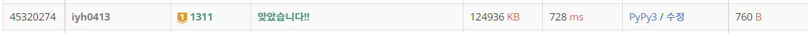

# [Baekjoon] 할 일 정하기 1 [G1]

## 📚 문제 : [할 일 정하기 1](https://www.acmicpc.net/problem/1311)

## 📖 풀이

n이 20까지 주어진다. 중복 없는 순열로 풀어야 하는데 n이 20이면 백트래킹으로 가지치기를 해도 시간초과가 발생한다. 따라서 비트마스킹 DP를 활용해서 풀어야 한다.

탑 다운 방식으로 해결했다.

dp를 1 << n 개만큼 선언하여 이미 확인한 visited면 확인하지 않는다.

visited를 데리고 다니며 탑다운 DP를 활용해서 해결한다.

다 일했을 때의 dp 값을 출력해야 하니 visited가 1 << n일 때로 시작한다.

일을 했는지 확인하기 위해서는 visited & (1 << i)로 확인한다.

일을 했으면 바꾸기 위해 visited ^ (1 << i)로 특정 비트를 반전시켜준다.


## 코드

```python
def recur(cur, visited):
    if cur < 0:                    # 다 일한 경우 종료
        return 0
    if dp[visited] != -1:           # 이미 확인한 경우
        return dp[visited]
    dp[visited] = INF
    for i in range(n):              # 일들을 순회
        if visited & (1 << i):      # 이미 했던 일인지 확인
            prv_visited = visited ^ (1 << i)
            dp[visited] = min(dp[visited], recur(cur - 1, prv_visited) + fee[cur][i])
    return dp[visited]

    
n = int(input())
fee = [list(map(int, input().split())) for _ in range(n)]          # 각 사람이 각각의 일을 할 수 있는 비용
INF = 10000 * n + 5
dp = [-1 for _ in range(1 << n)]     # 비용을 적을 DP

print(recur(n - 1, (1 << n) - 1))
```


## 🔍 결과


