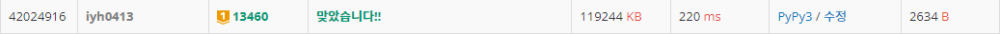

# [Baekjoon] 13460. 구슬 탈출 2 [G1]

## 📚 문제

https://www.acmicpc.net/problem/13460

---

## 📖 풀이

10번을 움직인다. 그러면 4방향으로 10번이니 4의 10제곱이 100만 정도이다. 

다른 연관된 복잡도를 고려하면 시간이 더 증가하니 시간초과가 발생할 수 있다. 

따라서 최적화하여, 백트래킹으로 경우의 수를 줄여나가면서 해결해본다.


먼저 빨간 공과 파란 공의 좌표를 기억한다. balls라는 2차원 배열을 만들고 빨간 공, 파란 공 순서대로 넣어준다.

공들의 위치는 따로 보관하며 움직여줄 것이다.

함수는 3가지 만든다.

### 조합을 만들어주는 함수

- 4가지 방향으로 움직이며 10번 재귀를 탐색한다. 10번까지 움직이므로 10번을 넘어서면 종료한다.

- 최적화를 위해 이미 나온 결과보다 더 많이 탐색하는 경우는 종료한다.

- 4방향으로 탐색하는데 이전에 움직였던 방향을 기억하며, 같은 방향이나 반대 방향인 경우는 보지 않는다.

  - 반대 방향으로도 탐색하지 않는 이유는, 이전에 반대방향으로 움직인 경우와 같기 때문이다.

- 공들의 위치를 복사해서 저장해준다. 그리고 움직이고 다시 되돌려놓는 과정을 반복한다.

- 파란 공이 빠지는 경우, 빨간 공이 빠지는 경우, 둘 다 빠지는 경우를 나누어 분기처리 해준다.

  

### 움직일 방향에 있는 벽으로부터 가까이 있는 공 고르는 함수

- 공이 같은 벽에 마주쳤을 때 가까이 있는 공부터 붙이고 그 뒤에 다른 공을 붙여야 하므로, 벽에 가까운지 확인해주는 함수를 만든다.

- 쉽게 생각할 수 있는게 방향의 값을 좌표에 곱해주고 그러면 움직일 방향으로의 크기 값이 나온다. 이 때 더 큰 값이 벽에 더 가까운 것이다.

- 음수인 경우는 0에 가까운 작은 값이 나와야 좋은데, 음수와 곱하니 크기는 작은 값이 더 커진다. 따라서 이렇게 식을 구해주기만 하면 된다.

- 빨간 공이 더 가까울 때 1을 출력하고, 아니면 0을 출력한다.

  

### 특정 방향으로 기울였을 때 공을 움직이는 함수

- 공을 움직인다. 이 때 벽을 만나거나 다른 공을 만나면 멈춘다. 그리고 0을 return한다.
- 구멍을 만나면 1을 return한다. 이 때 공은 -1, -1로 보냈는데, 둘 다 구멍에 들어가는 경우를 확인해줘야 하기 때문이다. 따라서 범위 밖으로 보내버렸다.


## 📒 코드

```python
def recur(cur, prv_d):
    global cnt, balls
    if cnt <= cur:      # 이미 나온 결과보다 더 횟수가 많거나 같으면 종료
        return
    if cur == 10:       # 10번 넘게 움직였으면 종료
        return

    balls_origin = [balls[0][:], balls[1][:]]       # 공의 위치를 기억
    for d in range(4):
        balls = [balls_origin[0][:], balls_origin[1][:]]    # 공의 위치를 움직였으니 원상복구
        if prv_d >= 0 and (d % 2 == prv_d % 2):   # 같은 방향이거나 반대 방향인 경우는 보지 않는다.
            continue                            # 처음에만 방향을 -1로 설정해 모든 방향을 확인하도록 한다.
        if red_order(d):
            if move(0, d):  # 빨간 공이 빠지는 경우
                if move(1, d):  # 파란 공이 빠지는 경우
                    continue
                cnt = min(cur + 1, cnt)
                return
            if move(1, d):  # 파란 공이 빠지는 경우
                continue
        else:
            if move(1, d):  # 파란 공이 빠지는 경우
                continue
            if move(0, d):  # 빨간 공이 빠지는 경우
                cnt = min(cur + 1, cnt)
                return
        recur(cur + 1, d)
    

def red_order(dir):
    red_order = balls[0][0] * dx[dir] + balls[0][1] * dy[dir]
    blue_order = balls[1][0] * dx[dir] + balls[1][1] * dy[dir]
    if red_order >= blue_order:  # 빨간 공이 움직이는 방향의 벽에 더 가까이 있는 경우
        return 1
    else:
        return 0


def move(color, dir):    # 공 움직이기
    x, y = balls[color]     # 고른 공의 좌표
    x_another, y_another = balls[1^color] # 다른 색 공의 좌표
    while True:
        x += dx[dir]
        y += dy[dir]
        if arr[x][y] == '#' or (x == x_another and y == y_another):      # 벽을 만나는 경우 or 다른 색 공을 만난 경우
            balls[color][0] = x - dx[dir]
            balls[color][1] = y - dy[dir]
            return 0
        elif arr[x][y] == 'O':    # 골인 되는 경우
            balls[color][0] = -1
            balls[color][1] = -1
            return 1

dx = [0, 1, 0, -1]  # 우 하 좌 상
dy = [1, 0, -1, 0]
n, m = map(int, input().split())
arr = [list(input()) for _ in range(n)]
balls = [[], []]    # red, blue 공
for i in range(n):
    for j in range(m):
        if arr[i][j] == 'R':
            balls[0] = [i, j]
            arr[i][j] = '.'
        if arr[i][j] == 'B':
            balls[1] = [i, j]
            arr[i][j] = '.'

cnt = 11
recur(0, -1)

if cnt == 11:
    print(-1)
else:
    print(cnt)
```

## 🔍 결과



