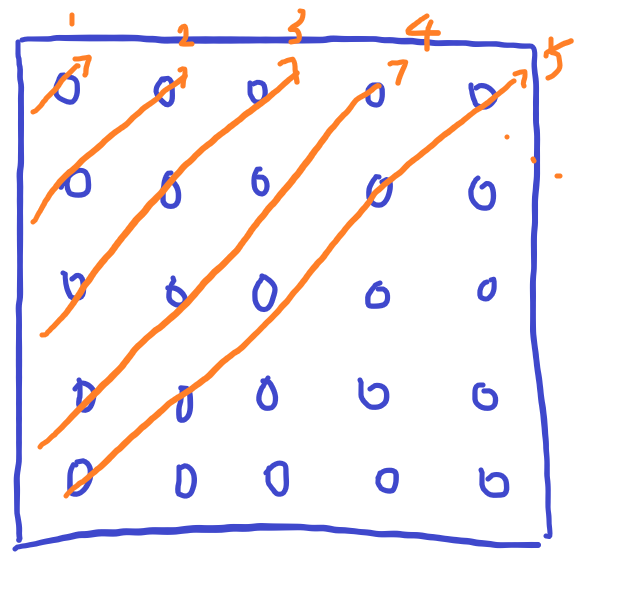
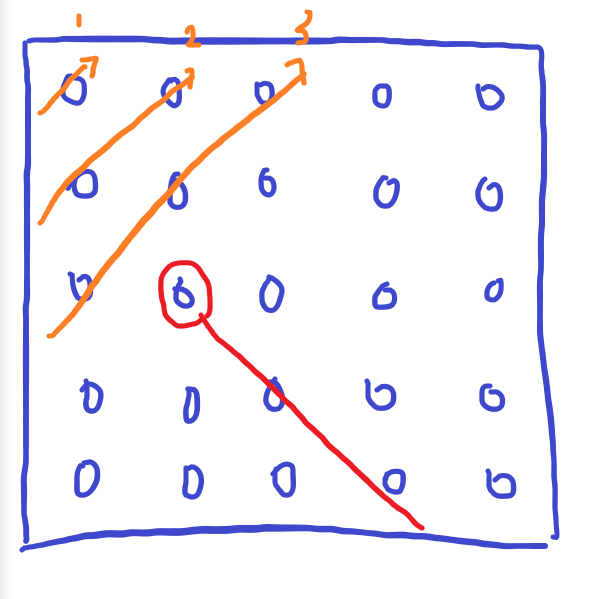

# [Baekjoon] 1799. 비숍 [G1]

## 📚 문제 : [비숍](https://www.acmicpc.net/problem/1799)

## 📖 풀이

체스판의 크기는 10이하의 자연수이다. 따라서 백트래킹을 이용해 해결해야 한다.

조합을 활용한 완전 탐색을 이용하면 2의 100제곱만큼의 경우의 수가 필요해 시간초과가 발생한다.

### 첫 번째 아이디어(시간 초과)

맨 왼쪽 위부터 오른쪽 방향으로 그리고 아래방향으로 확인한다.(모든 칸을 확인한다.)

현재 위치에 비숍을 둘 수 있는지 대각선 방향으로 체크해가며 확인해 비숍을 놓는 방법을 생각해본다.

모든 칸을 확인하므로 시간초과가 발생한다.

### 두 번째 아이디어

대각선 방향으로 체크한다.

현재 비숍을 뒀으면 다음 대각선으로 바로 넘어가서 놓을지 안 놓을지 결정한다.

비숍을 두면 바로 다음 행으로 넘어갈 수 있다.

비숍을 두는 경우 cross된 대각선도 놓을 수 없으므로 visited 배열에 대각선 값들을 담아준다.

빨간색 원이 비숍을 둔 것이다. 그러면 다음 행으로 넘어간다. 

사진에서 빨간색 선이 그어진 부분은 visited 배열에 담겨있어, 앞으로 확인하지 않는다.