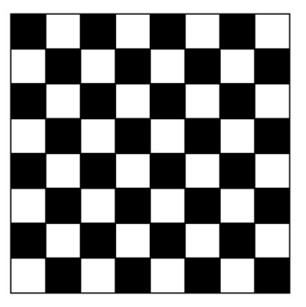
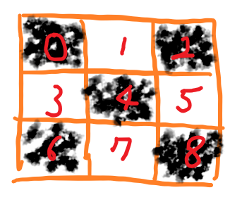
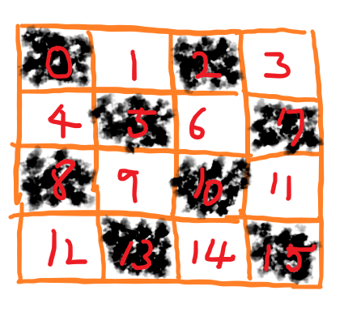
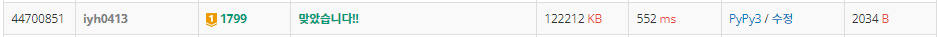

# [Baekjoon] 1799. 비숍 [G1]

## 📚 문제 : [비숍](https://www.acmicpc.net/problem/1799)

## 📖 풀이

체스판의 크기는 10이하의 자연수이다. 따라서 백트래킹을 이용해 해결해야 한다.

조합을 활용한 완전 탐색을 이용하면 2의 100제곱만큼의 경우의 수가 필요해 시간초과가 발생한다. 따라서 백트래킹을 사용한다.

- 남은 칸에 비숍을 두어도 현재 구했던 최댓값보다 작거나 같으면 가지치기한다.

위처럼 풀어도 시간초과가 발생한다.


### Black과 White 칸을 나누어 생각!

시간초과를 해결하기 위해서 체스판의 Black 칸과 White 칸을 분리해서 생각한다.



왜냐면 비숍은 Black 칸은 무조건 Black으로만 이동하고 White는 무조건 White로만 이동한다.

따라서 분리해서 생각한다.


흰색인 경우와 검정인 경우로 생각하려면 체스판을 이동할 때 체스판의 크기가 짝수인 경우와 홀수인 경우로 분리한다.

- 홀수인 경우

  

  - 2칸 씩 이동하면 된다.

    

- 짝수인 경우

  - 짝수인 경우가 중요하다.

  

  - 짝수인 경우는 2칸씩 이동하면 세로로 같은 위치를 보게된다.
  - 2에서는 5로 7에서는 8로 이동해야 한다. 따라서 다음 줄로 이동할 때 현재 칸에서 짝수이면 홀수로 홀수였으면 짝수로 이동하게 설계한다.

현재 위치에 비숍을 두었으면 visited 배열에 비숍을 두었다고 표시한다.

비숍이 있는지 체크할 때는 대각선 위쪽 방향만 체크한다. 왜냐하면 왼쪽 위부터 오른쪽 아래로 내려오니, 아래 방향은 어차피 아직 비숍을 두기 전이라 체크할 필요가 없다.

## 📒 코드

```python
def in_range(x, y):     # 체스판 범위 안인지 확인
    return 0 <= x < n and 0 <= y < n


def check(x, y):        # 대각선에 비숍있는지 체크
    for i in range(2):      # 왼쪽 위, 오른쪽 위 대각선 체크
        nx = x + dx[i]
        ny = y + dy[i]
        while in_range(nx, ny):    # 체스판 범위 안인 경우
            if visited[nx][ny]:     # 대각선에 비숍이 놓여 있는 경우 False
                return False
            nx += dx[i]
            ny += dy[i]
    return True             # 대각선에 비숍이 없는 경우 True


def recur(x, y, cnt):   # 2칸씩 건너띄며 확인
    color = (x + y) % 2     # 현재 칸의 색
    if not in_range(x, y):       # 다 확인한 경우
        result[color] = max(result[color], cnt)      # 최댓값 갱신
        return
    if (n * n - 1 - (x * n + y)) // 2 + 1 + cnt <= result[color]:   # 남은 칸에 다 비숍을 놔도 최대값을 바꾸지 못하는 경우
        return

    # 다음 같은 색의 좌표 값 구하기
    ny = y + 2
    nx = x + ny // n
    if ny >= n:      # 다음 행으로 이동
        if n % 2:       # 체스판의 크기 n이 홀수인 경우
            ny %= n
        else:           # 체스판의 크기 n이 짝수인 경우
            ny = 0 if ny % 2 else 1

    if arr[x][y] and check(x, y):   # 비숍을 놓을 수 있을 때
        visited[x][y] = 1
        recur(nx, ny, cnt + 1)
        visited[x][y] = 0
    recur(nx, ny, cnt)              # 비숍을 놓지 않을 때


n = int(input())
arr = [list(map(int, input().split())) for _ in range(n)]       # 비숍을 놓을 수 있는 칸이 입력으로 주어진다.

visited = [[0] * n for _ in range(n)]
dx, dy = [-1, -1], [-1, 1]  # 왼쪽 위, 오른쪽 위
result = [0, 0]     # 칸이 흰색인 경우와 검정인 경우 나눠서 구한다.
recur(0, 0, 0)      # 칸이 검정인 경우
recur(0, 1, 0)      # 칸이 흰색인 경우
print(sum(result))      # 칸이 흰색 검정인 경우의 값을 더한다.
```

## 🔍 결과

