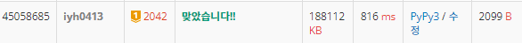

# [Baekjoon] 2042. 구간 합 구하기 [G1]

## 📚 문제 : [구간 합 구하기](https://www.acmicpc.net/problem/2042)

## 📖 풀이

구간의 합을 출력하거나, 특정 위치에서의 수를 변경한다.

구간합을 구할 때 시간 복잡도를 O(logN)으로 만들기 위해 **세그먼트 트리**를 사용한다.

구간의 중심으로부터 왼쪽의 합 오른쪽의 합을 나누어가며 구한다. 따라서 O(logN)으로 구간의 합을 구현할 수 있다.

### 세그먼트 트리 !

1. 세그먼트 트리로 구간합 설계

   - 세그먼트 트리는 0번부터 시작하지 않고 1번부터 시작한다.
     - 이 때 1부터 시작하는 이유는 자식의 인덱스 값이 왼쪽은 곱하기 2, 오른쪽은 곱하기 2 + 1로 쉽게 생각할 수 있기 때문이다.

   - 세그먼트 트리를 초기화 하기 위해 n보다 큰 가장 가까운 제곱수 * 2를 구해야 한다.
     - 따라서 넉넉하게 n에 4를 곱한 수로 초기화 하면 된다.

2. 값 변경에 따른 세그먼트 트리의 구간합 변경
   - 세그먼트 트리를 탐색하며, 바꾸고 싶은 노드의 인덱스가 있는 경우 바꾸는 수와의 차이만큼 더해준다.
   - 범위가 밖인 경우는 return하고, 범위가 안인 경우는 차이만큼 더해주고 return
3. 구간합 구하기
   - 범위 안일 경우는 세그먼트 트리 값을 return, 범위 밖인 경우는 0을 return

## 📒 코드

```python
import sys
input = sys.stdin.readline


def seg_init(s, e, index):      # 세그먼트 트리 구간합 설정
    if s == e:                  # s, e가 같은 경우는 그 때의 배열의 값을 return
        tree[index] = arr[s]
        return tree[index]
    mid = (s + e) // 2          # 중간 값 구하기
    left = seg_init(s, mid, index * 2)              # index * 2는 왼쪽
    right = seg_init(mid + 1, e, index * 2 + 1)     # index * 2 + 1은 오른쪽
    tree[index] = left + right
    return tree[index]


def seg_update(s, e, index, target, dif):    # 새로운 노드 값으로 업데이트
    if not s <= target <= e:        # 범위 밖이면 종료
        return
    tree[index] += dif              # 변화된 값을 더해준다.
    if s == e:                      # 하나 남은 거 갱신했으니 종료
        return
    mid = (s + e) // 2
    # 왼쪽과 오른쪽으로 나누어서 탐색하며 새로운 구간합 업데이트
    seg_update(s, mid, index * 2, target, dif)
    seg_update(mid + 1, e, index * 2 + 1, target, dif)


def seg_sum(s, e, index, left, right):           # 구간합 구하기
    if left <= s and e <= right:                # 범위 안인 경우
        return tree[index]
    if e < left or s > right:                  # 범위 밖인 경우
        return 0
    # 교집합이 존재하지만 포함관계가 아닌 경우
    mid = (s + e) // 2
    return seg_sum(s, mid, index * 2, left, right) + seg_sum(mid + 1, e, index * 2 + 1, left, right)


n, m, k = map(int, input().split())     # n: 수의 개수, m: 수의 변경 횟수, k: 구간의 합 구하는 횟수
arr = [0]   # 인덱스를 1부터 시작하게 하기 위함
for _ in range(n):
    arr.append(int(input()))
tree = [0 for _ in range(4 * n)]
seg_init(1, n, 1)   # 초기 세그먼트 트리 세팅!

for i in range(m + k):
    a, b, c = map(int, input().split())
    if a == 1:      # 수 변경
        dif = c - arr[b]        # 바꾼 노드와 원래 값과의 차이
        arr[b] = c
        seg_update(1, n, 1, b, dif)
    else:           # 구간합 출력
        print(seg_sum(1, n, 1, b, c))
```

## 🔍 결과

