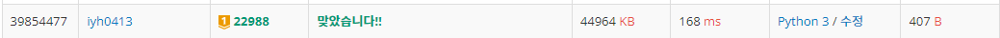

# [Baekjoon] 22988. 재활용 캠페인 [G1]

## 📚 문제

https://www.acmicpc.net/problem/22988

---

min(A+B+X/2, X)로 채워준다. 그러면 0이 있는 3개의 병을 가져가도 꽉채워준다. 따라서 최소한 3병을 가져가면 무조건 꽉 채워서 준다.

먼저 이미 꽉차있는 병들의 개수를 결과값에 더해주고 뺀다. 그리고 나머지를 오름차순으로 정렬시킨다.

그리고 2병씩 모아 가장 많이 꽉 채울 수 있는 경우로 계산해주어야 한다. 제일 큰 값은 그대로 놔두고 제일 작은 수를 하나씩 키우면서 확인한다.

~~처음에는 del함수로 제거하면서 2개씩 합쳐주었는데 시간초과가 발생하였다.~~ del 함수를 사용하면 시간 복잡도가 **O(n)**이라 최대한 안쓰는 방법으로 찾아야 한다.

따라서 투포인터로 계산하여 2병이 만들어지면 e를 왼쪽으로 옮기며 확인한다.

> 1. 두 용기를 합쳐 꽉 찬 용기를 만들 수 있는지 확인해 만들 수 있으면 s와 e를 한 칸씩 전진시킨다. 그리고 결과값에 1을 더한다. 남아있는 용기의 개수에서 2를 빼준다.
> 2. 두 용기를 합쳐 꽉 찬 용기를 만들 수 없으면 s만 1 전진한다.

위 방법으로 2병씩 모아준다. 그리고 나머지 3병씩 모으기 위해 3으로 나눈 몫을 결과값에 더해준다.

## 📒 코드

```python
n, x = map(int, input().split())        # n: 용기의 수, x: 용기의 총 용량
arr = list(map(int, input().split()))   # 가지고있는 용기의 용량들의 집합
arr.sort()          # 오름차순으로 정렬한다.
result = 0          # 가득찬 용기의 개수

for i in range(len(arr)):       # 오름차순으로 정렬한 걸 앞에서부터 센다.
    if arr[i] == x:             # 가득차 있는 용기가 나오는지 확인
        result = len(arr) - i   # 가득차 있는 용기의 개수를 result에 더해준다.
        arr = arr[0:i]          # 가득차 있는 용기들을 제외한다.
        break

s = 0                           # 투포인터 앞에서와 뒤에서 시작한다.
e = len(arr) - 1
length = len(arr)               # 남은 개수를 센다.

while s < e:                    
    if 2 * (arr[s] + arr[e]) >= x:  # 두 용기를 더해서 절반보다 큰지 확인한다.
        e -= 1                      # 크면 e를 1 빼고 s를 1 더한다.
        result += 1                 # 두 용기를 하나로 합쳐 result에 더해준다.
        length -= 2                 # 남은 용기의 개수에 2개를 빼준다.
    s += 1                          # 크던 작던 s는 1씩 움직인다.

result += length // 3               # 남아있는 용기를 3으로 나눈 몫을 더한다.

print(result)
```

## 🔍 결과



