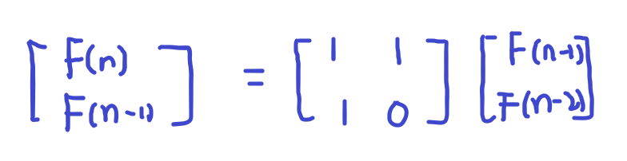
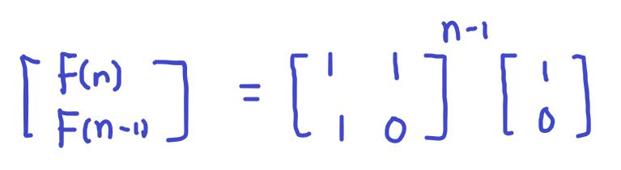

# [Baekjoon] 11444. 피보나치 수 6 [G2]

## 📚 문제

https://www.acmicpc.net/problem/11444

---

## 📖 풀이

n이 1,000,000,000,000,000,000과 같이 주어졌으므로 점화식으로 더하면서 DP로 풀면 무조건 O(n) 이므로 무조건 시간초과가 발생한다.

피보나치 수를 해결할 수 있는 방법들을 찾아본다.

> ~~피사노 주기~~
>
> ~~피보나치는 정수로 나누면 주기가 나타난다.~~
>
> ~~피사노 주기는 1,000,000,007도 너무 커서 사용할 수 없다.~~

**피사노 주기**를 사용하기에는 모듈러 연산을 수행할 값이 너무 크다.

>누승법, 행렬 멱법(Matrix Exponentiation)
>
>O(n)을 O(log(n))으로 만들어 준다.
>
>점화식을 행렬화 시켜서 푸는 방법이다.

**행렬 멱법**이 적용가능하다.

점화식 문제의 시간복잡도를 **O(log(n))**로 줄여준다.

피보나치 점화식을 먼저 적어보면,

> F(n) = F(n-1) + F(n-2)

이를 행렬로 표현한다. n과 n-1, n-2 세개로 나타내어야 하니 2x2 행렬로 나타낸다.

좌변에는 n과 n-1을 우변에는 n과 n-2가 있게 만든다.

그러기 위해서 F(n-1) = F(n-1)식을 이용한다.

행렬을 그려보면 다음과 같다.



좌변과 우변의 항이 하나씩 뺀 이유는 행렬의 거듭제곱을 이용하기 위함이다.

여기서 점화식처럼 생각해보면 `[[1, 1], [1, 0]]`이 n이 증가할수록 곱해지는 형태이니 다음과 같다.



행렬의 거듭제곱은 **분할정복**을 활용해 O(n)을 O(logn)으로 줄여준다.

행렬을 곱해주는 함수와 거듭제곱을 분할정복으로 줄여나가는 함수를 만들어서 해결한다.

분할정복을 할 때 재귀를 사용하는데 거듭제곱이 1인 경우는 곱하지 않는 경우니까 return하고, 거듭제곱이 2인 경우까지 연산하도록 한다.

중간 중간 연산마다 모듈러 1,000,000,007 연산을 해준다.

## 📒 코드

```python
def matrix_s(m):            # 행렬 곱, 입력에는 초기 행렬이나, 현재 결과 행렬만 들어온다.
    a, b = result_arr[0]    # 결과행렬이 들어오는 경우는 제곱, 아니면 곱이다.
    c, d = result_arr[1]
    e, f = m[0]
    g, h = m[1]
    result_arr[0][0] = (a * e + b * g) % 1_000_000_007
    result_arr[0][1] = (a * f + b * h) % 1_000_000_007
    result_arr[1][0] = (c * e + d * g) % 1_000_000_007
    result_arr[1][1] = (c * f + d * h) % 1_000_000_007


def recur(n):   # 거듭제곱 분할정복
    if n == 1:
        return

    if n // 2:
        recur(n // 2)
        matrix_s(result_arr)   # 제곱 연산

    if n % 2:
        matrix_s(first_arr) # 그냥 곱 연산


n = int(input())
first_arr = [[1, 1], [1, 0]]       # 초기 행렬
result_arr = [[1, 1], [1, 0]]      # 결과 행렬
recur(n - 1)
print(result_arr[0][0] % 1_000_000_007)
```

## 🔍 결과


점화식으로 풀 수 있는 문제들을 해결할 때 시간 복잡도를 O(n)으로 해결하기 힘들 때 행렬을 이용하는 방법을 생각해보자~!