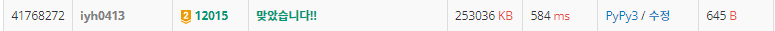

# [Baekjoon] 12015. 가장 긴 증가하는 부분 수열 2 [G2]

## 📚 문제

https://www.acmicpc.net/problem/12015

---

## 📖 풀이

n이 1000000이라 완전 탐색인 O(n^2)으로 해결할 수 없는 문제이다.

이진탐색으로 구해본다. 이진탐색으로 구하는 경우는 O(nlogn)으로 구할 수 있다.

lis 배열을 따로 만들어 값을 바꿔준다.

규칙은 다음과 같다.

1. lis에 있는 수들보다 꺼낸 수가 크다면 append 해준다.

   lis는 오름차순으로 정렬이 된다. 따라서 **매개변수 탐색**으로 바꿔줄 수 있다.

2. lis의 맨 오른쪽 수보다 더 작으면 lis에 수를 삽입한다. 이 때 자기보다 크거나 같은 수 중 가장 작은 수와 바꿔준다.

   > xxxxooooooo... => o 중 가장 작은 수와 바꾼다.

위 방법대로 예제를 직접 구해본다.

A : 10 20 10 30 20 50

수열 A의 앞에서부터 하나씩 꺼내 lis에 넣어준다.

1. 10을 꺼낸다.

   lis에 수가 없으니 10을 넣어준다.

   > lis = [10]

2. 20을 꺼낸다.

   lis의 가장 큰 수는 10이므로 20을 오른쪽에 넣어준다.

   > lis = [10, 20]

3. 10을 꺼낸다.

   lis의 가장 큰 수인 20보다 작으므로 10보다 크거나 같은 수 중 작은 값과 바꿔준다. 10이니 10과 바꿔주니 그대로다.

   > lis = [10, 20]

4. 30을 꺼낸다.

   lis의 가장 큰 수는 20이므로 30을 오른쪽에 넣어준다.

   > lis = [10, 20, 30]

5. 20을 꺼낸다.

   lis의 가장 큰 수는 30이므로 20보다 크거나 같은 수중 가장 작은 값을 찾는다. 20이니 그대로이다.

   > lis = [10, 20, 30]

6. 50을 꺼낸다.

   lis의 가장 큰 수는 30이므로 50을 오른쪽에 넣어준다.

   > lis = [10, 20, 30, 50]

lis의 길이가 4이다.

## 📒 코드

```python
def binary_search(x):   # 매개변수 탐색(이진 탐색)
    s, e = 0, len(lis) - 1
    ans = 0
    while s <= e:
        mid = (s + e) // 2
        if lis[mid] == x:   # 같은 수가 있다면 return
            return mid
        elif lis[mid] > x:  # 큰 수 중 가장 작은 수를 매개변수 탐색
            ans = mid
            e = mid - 1
        else:
            s = mid + 1
    return ans


n = int(input())
arr = list(map(int, input().split()))
lis = [arr[0]]  # 시작부분을 넣어준다.

for i in range(1, n):
    num = arr[i]
    if lis[-1] < num:       # lis 값들보다 크면 맨 오른쪽에 삽입
        lis.append(num)
    elif lis[-1] > num:     # lis의 가장 큰 수보다 작으면 크거나 같은 값들 중 가장 작은 수와 바꾼다.
        lis[binary_search(num)] = num

print(len(lis))
```

## 🔍 결과

