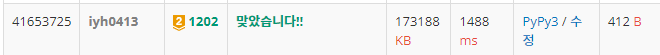

# [Baekjoon] 1202. 보석 도둑 [G2]

## 📚 문제

https://www.acmicpc.net/problem/1202

---

## 📖 풀이

**최대힙** 즉, **우선순위 큐**를 활용하여 문제를 해결한다.

보석과 가방을 무게 순으로 오름차순 정렬을 한다.

그리고 가방이 작은 것부터 하나씩 순회하면서, 가방보다 크거나 작은 보석들의 가치를 최대힙에 담는다.

없으면 안 담고 여러 개 있는 경우는 여러 개를 담는다.

다 담으면 가방에서 가치가 큰 걸 하나 꺼내고 다음 가방을 탐색한다.

가방의 무게가 작은 것부터 최대의 가치를 꺼내는 것이다.

## 📒 코드

```python
import heapq
import sys
input = sys.stdin.readline


n, k = map(int, input().split())
jams = sorted([list(map(int, input().split())) for _ in range(n)])  # 무게 순으로 정렬
bags = sorted([int(input()) for _ in range(k)])     # 무게 순으로 정렬

heap = []   # 가치가 큰 것부터 담을 최대 힙
s = 0
total = 0
for bag in bags:        # 무게가 작은 가방부터 순회
    while s < len(jams) and bag >= jams[s][0]:  # 현재 가방보다 무게가 작거나 같은 보석들을 순회
        heapq.heappush(heap, -jams[s][1])       # heap에 보석의 가치를 큰 순서대로 담는다.
        s += 1
    if heap:    # 힙에 가치가 가장 큰 것부터 가방 하나당 하나씩 꺼낸다.
        total += -heapq.heappop(heap)
print(total)
```

## 🔍 결과

