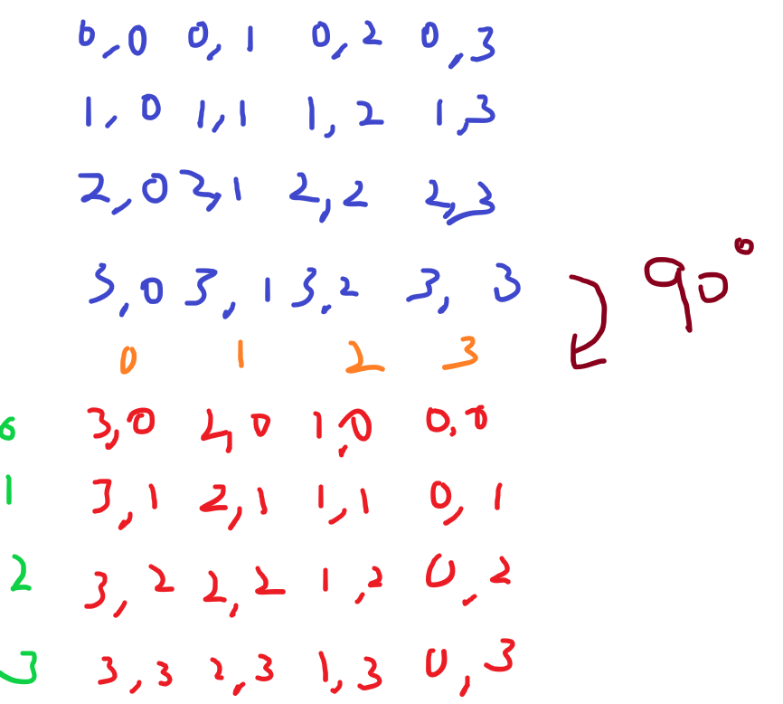
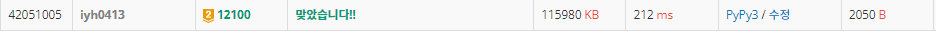

# [Baekjoon] 12100. 2048 (Easy) [G2]

## 📚 문제

https://www.acmicpc.net/problem/12100

---

## 📖 풀이

네 방향으로 이동하는 걸 총 5번 해보면 되니, 조합으로 해결한다.


### 조합을 만들어주는 함수

재귀함수로 조합을 구현한다.

5번 돌면 그 때 최댓값을 확인한다.

이 때 기울일 때 배열 값이 바뀌니 그걸 되돌리기 위해 `[:]` 얕은 복사를 활용해야 한다.


### 배열을 90도 시계방향으로 돌리는 함수

네 방향으로 움직이기보단 배열을 돌린다.

90도 돌렸을 때 점화식을 찾기 위해 아래와 같이 그림을 그려본다.(~~대충 그림..~~)



배열의 값을 이전 배열의 값들을 저장해 90도 돌려 새로 넣어준다.

> `arr[i][j] = arr2[n-j-1][i]`

4방향이니 총 3번 돌려주면 된다.


### 왼쪽으로만 움직이며 합쳐주는 함수

네 방향 중 왼쪽인 이유는 왼쪽으로 기울인 후 각각의 행을 슬라이싱을 통해 넣어주기 편하다.

합쳐주는 방법은 다음과 같다.

1. 0이 아닌 값을 배열에 담는다.(특히 배열의 원소가 없을 땐 그냥 담는다.)
2. 이전에 합쳤는지 확인하는 boolean flag를 하나 만들어 합쳐줬을 땐 무조건 다음에 합치지 않도록 설정해준다.
3. 이전에 합치지도 않았고, 배열의 맨 끝 값이 현재 확인한 값과 같을 때 합쳐준다.

다 합치고나서 나온 배열을 뒤에 0을 채워서 넣어준다.

모든 행을 다 해준다.


### 최댓값을 확인하는 함수

최댓값을 확인하는 건 간단하다.

2차원 배열을 순회하며 최댓값을 찾아주면 된다.


## 📒 코드

```python
def recur(cur):
    global arr, max_result
    if cur == 5:    # 5번 기울인 후 확인
        max_result = max(check(), max_result)
        return
    arr_origin = [arr[i][:] for i in range(n)]      # 원본 값 저장
    move()                                          # 기울이기
    recur(cur + 1)
    for _ in range(3):
        arr = [arr_origin[i][:] for i in range(n)]      # 기울이기 전으로 되돌린다.
        turn()                                          # 90도 회전
        arr_origin = [arr[i][:] for i in range(n)]      # 원본 값 저장
        move()                                          # 기울이기
        recur(cur + 1)


def turn():     # 시계 방향으로 90도 배열을 돌린다.
    arr_origin = [arr[i][:] for i in range(n)]
    for i in range(n):
        for j in range(n):
            arr[i][j] = arr_origin[n-j-1][i]


def move():     # 왼쪽으로 기울인다.
    for i in range(n):
        blocks = []     # 행 별로 블록들을 합쳐준다.
        sum_flag = 0    # 합친 블록인지 표시
        for j in range(n):  # 왼쪽부터 블록들을 확인한다.
            block = arr[i][j]
            if not block:   # 비어있는 경우
                continue
            # 이전 블록을 합치지 않고, 이전 블록 값과 같은 경우
            if sum_flag == 0 and blocks and blocks[-1] == block:
                blocks[-1] = block * 2
                sum_flag = 1    # 합친 블록이라고 표시
            else:
                sum_flag = 0    # 새로 넣어주니 합치지 않았다고 표시
                blocks.append(block)    # 새로 넣어준다.
        blocks += [0] * (n - len(blocks))
        arr[i] = blocks[:]


def check():    # 최댓값을 확인해 현재 최대값보다 큰지 확인한다.
    mmax = 0
    for i in range(n):
        for j in range(n):
            mmax = max(mmax, arr[i][j])
    return mmax


n = int(input())
arr = [list(map(int, input().split())) for _ in range(n)]
max_result = 0
recur(0)
print(max_result)
```

## 🔍 결과

