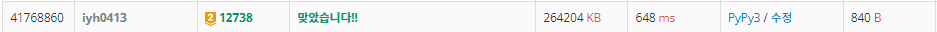

# [Baekjoon] 12738. 가장 긴 증가하는 부분 수열 3 [G3]

## 📚 문제

https://www.acmicpc.net/problem/12738

---

## 📖 풀이

이진 탐색을 활용한 문제이다.

이전에 구했던 가장 긴 증가하는 부분 수열 2와 풀이가 동일하다.

### 📌 가장 긴 증가하는 부분 수열 2 풀이

https://velog.io/@yunhlim/Baekjoon-12015.-%EA%B0%80%EC%9E%A5-%EA%B8%B4-%EC%A6%9D%EA%B0%80%ED%95%98%EB%8A%94-%EB%B6%80%EB%B6%84-%EC%88%9C%EC%97%B4-2-G2

## 📒 코드

```python
def binary_search(x):   # 매개변수 탐색(이진 탐색)
    s, e = 0, len(lis) - 1
    ans = 0
    while s <= e:
        mid = (s + e) // 2
        if lis[mid] == x:   # 같은 수가 있다면 return
            return mid
        elif lis[mid] > x:  # 큰 수 중 가장 작은 수를 매개변수 탐색
            ans = mid
            e = mid - 1
        else:
            s = mid + 1
    return ans


n = int(input())
arr = list(map(int, input().split()))
lis = [arr[0]]  # 시작부분을 넣어준다.

for i in range(1, n):
    num = arr[i]
    if lis[-1] < num:       # lis 값들보다 크면 맨 오른쪽에 삽입
        lis.append(num)
    elif lis[-1] > num:     # lis의 가장 큰 수보다 작으면 크거나 같은 값들 중 가장 작은 수와 바꾼다.
        lis[binary_search(num)] = num

print(len(lis))
```

## 🔍 결과

