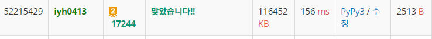

# [Baekjoon] 17244. 아맞다우산 [G2]

## 📚 문제 : [아맞다우산](https://www.acmicpc.net/problem/17244)

## 📖 풀이

**BFS** 문제이다.

출발지랑 물건들의 위치와 도착점을 point로 잡고 각각의 point에서 point로의 최소 시간을 구한다.

따라서 bfs를 물건의 개수 + 2 번만 돌면 된다.

구현하기 편하게 하기 위해 딕셔너리를 2개 사용한다.

출발점을 0, 물건들을 1 ~ n(물건의 개수), 도착점을 n + 1로 key로 잡고 그 때의 좌표 값을 value로 하는 딕셔너리를 만든다.

그리고 반대로 좌표 값을 활용해 각각의 번호를 알려주는 딕셔너리를 작성하면 탐색 시간을 줄일 수 있다.

bfs로 s에서 e로 향하는 각각의 최소 시간을 2차원 배열에 담는다.

시작점에서 출발해 모든 물건들을 돌고 도착점을 향하는 모든 순열 경우의 수를 재귀함수로 작성한다. 이 때 각각 물건에 도착할 때의 최소 시간을 더해주고 마지막 도착점에 도달했을 때 최소 값인지 확인 후 바꾸어준다.

## 📒 코드

```python
from collections import deque


# 순열
def recur(cur, prv, time):
    global min_time
    if cur == len(destination) - 2:   # 물건을 다 찾은 경우
        min_time = min(min_time, time +
                       times[prv][len(destination) - 1])
        return

    for i in range(1, len(destination) - 1):
        if visited[i]:
            continue
        visited[i] = True
        recur(cur + 1, i, time + times[prv][i])
        visited[i] = False


# bfs로 각 point에서 각각 다른 point까지 걸리는 최소 시간 구하기
def bfs(node):
    arr_copy = [arr[i][:] for i in range(n)]
    que = deque()
    x, y = destination[node]
    que.append((x, y))
    arr_copy[x][y] = '#'

    d = 0
    while que:
        for _ in range(len(que)):
            x, y = que.popleft()
            for i in range(4):
                nx = x + dx[i]
                ny = y + dy[i]
                if not (0 <= nx < n and 0 <= ny < m):
                    continue
                if arr_copy[nx][ny] != '#':
                    if arr_copy[nx][ny] == 'X':
                        times[node][stuff_num_find[(nx, ny)]] = d + 1
                    elif arr_copy[nx][ny] == 'S':
                        times[node][0] = d + 1
                    elif arr_copy[nx][ny] == 'E':
                        times[node][len(destination) - 1] = d + 1
                    que.append((nx, ny))
                    arr_copy[nx][ny] = '#'
        d += 1


m, n = map(int, input().split())
arr = [list(input()) for _ in range(n)]     # map 정보
stuff_cnt = 0                                  # 물건들 개수
dx, dy = [1, 0, -1, 0], [0, 1, 0, -1]
INF = 1000000
min_time = INF
# 시작점 , 물건들, 도착점으로 정리 : 시작점의 key는 0, 물건들은 1 ~ 물건 개수, 도착점은 물건 개수 + 1
destination = {}
# 물건 좌표로 번호 찾기
stuff_num_find = {}

for i in range(n):
    for j in range(m):
        if arr[i][j] == 'X':
            stuff_cnt += 1
            destination[stuff_cnt] = (i, j)
            stuff_num_find[(i, j)] = stuff_cnt
        elif arr[i][j] == 'S':
            destination[0] = (i, j)     # 시작점은 0
        elif arr[i][j] == 'E':
            end = (i, j)

destination[stuff_cnt + 1] = end        # 도착점은 물건 개수 + 1

times = [[0] * (len(destination))
         for _ in range(len(destination))]     # 각 point 간의 최소 소요 시간

for i in range(len(destination)):
    bfs(i)

visited = [0 for _ in range(stuff_cnt + 1)]    # 물건을 찾았는지 표시
recur(0, 0, 0)
print(min_time)

```

## 🔍 결과

