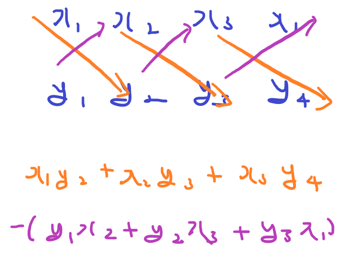
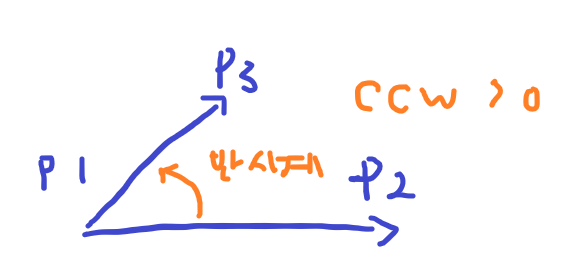
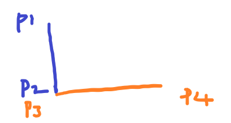
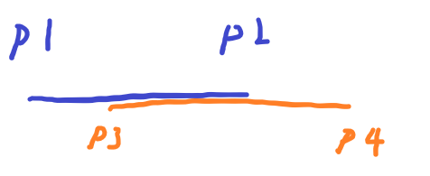
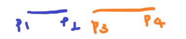
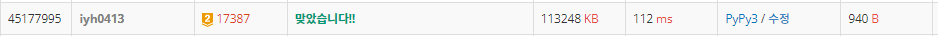

# [Baekjoon] 17387. 선분 교차 2 [G2]

## 📚 문제 : [선분 교차 2](https://www.acmicpc.net/problem/17387)

## 📖 풀이

나올 수 있는 길이가 2000000이라 이차원 배열로 방문표시하면 메모리 초과가 발생한다.

선분의 교차점으로 해결하려고 하면 나눗셈인 실수 계산이 들어가 출력된 값에 에러가 발생한다.

기하 알고리즘을 공부할 때 필수로 알아야 하는 **CCW**로 해결해야 한다.

### CCW 란?

예전 삼각형의 넓이를 구하던 사선 공식과 동일하다.

세 점을 이용하여 각도를 구한다.

p1 = (x1, x1), p2 = (x2, y2), p3 = (x3, y3), p4 = (x4, y4)라고 하면

CCW(p1,p2,p3)는 아래와 같이 구할 수 있다.



위 처럼 구하면 p1을 축으로 p1과 p2의 벡터와 p1과 p3의 벡터의 회전 방향이 시계방향인지 반시계방향인지에 따라 값이 나온다. 같은 라인에 있으면 0이다.

CCW의 뜻은 Counter Clock Wise로 반시계방향일 때 양수가 나온다고 외우면 쉽다.




1. 직선에서 겹치는지 확인 할 때에는 한 선분에서 다른 선분의 양 끝점으로 CCW를 구해 두 CCW의 값을 곱하여 교차하는지 판단한다.

   `CCW(p1, p2, p3) * CCW(p1, p2, p4) < 0`

2. 직선 같은 경우는 한 선분을 기준으로 삼아 CCW의 곱을 구하면 되지만, **선분**인 경우는 두 선분 각각 CCW의 곱을 구해보아야 한다.

   `(CCW(p1, p2, p3) * CCW(p1, p2, p4) < 0) and (CCW(p3, p4, p1) * CCW(p3, p4, p2) < 0)`

   > 이유는 직선으로 만나지만 선분으로는 안 만나는 경우가 있다.
   >
   > - CCW의 곱이 하나는 0보다 작지만, 하나는 0보다 크게 된다.
   >
   > - 따라서 선분으로 만나는지 구하려면 양 선분 둘 다 CCW의 곱이 0이어야 한다.

3. 두 선분의 교차점이 p1, p2, p3, p4 위에 있거나, 하나의 직선 위에 네 점이 놓이는 경우

   `(CCW(p1, p2, p3) * CCW(p1, p2, p3) == 0) and (CCW(p3, p4, p1) * CCW(p3, p4, p2) == 0)`





따라서 두 선분에서 CCW 곱이 다 0보다 작거나 같게된다면 그 때는 교차하는 것이다.

**이 때 주의할 점은 두 선분에서의 CCW의 곱이 다 0이면, 이 때에는 겹치는 지 확인해주어야 한다.**

p1 < p2 이고 p3 < p4라고 하면, p3 <= p2 and p1 <= p4를 만족하면 두 직선은 교차한다.

만족하지 않는 경우는 아래와 같다.



## 📒 코드

```python
def ccw(p1, p2, p3):
    return p1[0] * p2[1] + p2[0] * p3[1] + p3[0] * p1[1] - \
        (p1[1] * p2[0] + p2[1] * p3[0] + p3[1] * p1[0])


x1, y1, x2, y2 = map(int, input().split())
x3, y3, x4, y4 = map(int, input().split())
p1, p2 = [x1, y1], [x2, y2]
p3, p4 = [x3, y3], [x4, y4]

p12 = ccw(p1, p2, p3) * ccw(p1, p2, p4)  # p1, p2 선분으로 p3과 p4에 대한 ccw의 곱
p34 = ccw(p3, p4, p1) * ccw(p3, p4, p2)  # p3, p4 선분으로 p1과 p2에 대한 ccw의 곱
if p12 <= 0 and p34 <= 0:   # 두 선분이 교차하는 경우(한 직선 위에 있을 때 생각!)
    if p12 == 0 and p34 == 0:   # 두 선분이 같은 라인에 있을 때
        p1, p2 = min(p1, p2), max(p1, p2)
        p3, p4 = min(p3, p4), max(p3, p4)
        if p3 <= p2 and p1 <= p4:       # 두 선분이 만나는 경우
            print(1)
            exit()
    else:
        print(1)
        exit()
print(0)        # 나머지는 교차하지 않는다.
```

## 🔍 결과


