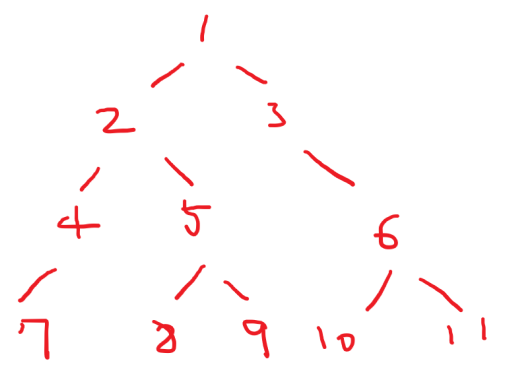
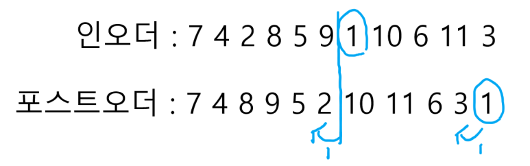
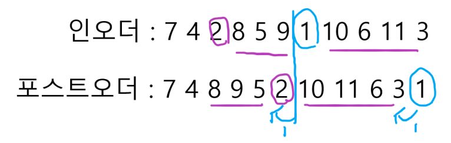
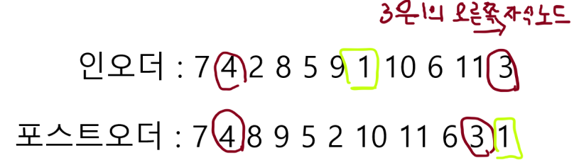
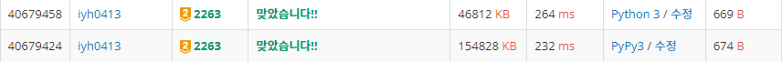

# [Baekjoon] 2263. 트리의 순회 [G2]

## 📚 문제

https://www.acmicpc.net/problem/2263

---

## 📖 풀이

인오더와 포스트오더가 주어졌을 때

프리오더를 구하여라!!

이진 트리이지 완전이진트리는 아니다!!

예제를 하나 만들어서 생각해본다.

다음 그림의 인오더와 포스트오더를 구해본다.



| 인오더     | 7    | 4    | 2    | 8    | 5    | 9    | 1    | 10   | 6    | 11   | 3    |
| ---------- | ---- | ---- | ---- | ---- | ---- | ---- | ---- | ---- | ---- | ---- | ---- |
| 포스트오더 | 7    | 4    | 8    | 9    | 5    | 2    | 10   | 11   | 6    | 3    | 1    |

포스트 오더의 1부터 확인한다.




1이 인오더에서 순서를 확인하면 7이다. 따라서 1의 왼쪽과, 인오더에서 1의 순서인 7번째 순서 왼쪽 값이 1의 자식 노드이다. 1의 자식 노드를 확인해보면 3과 2임을 알 수 있다.

포스트오더로 값을 확인하며 인오더는 카운팅 배열로 어디있는지 확인한다!!


인오더의 순서를 배열에 담는다. (배열의 인덱스 : 노드 번호, 배열의 값 : 인오더에서의 위치)

| 인덱스      | 1    | 2    | 3    | 4    | 5    | 6    | 7    | 8    | 9    | 10   | 11   |
| ----------- | ---- | ---- | ---- | ---- | ---- | ---- | ---- | ---- | ---- | ---- | ---- |
| 인오더 순서 | 7    | 3    | 11   | 2    | 5    | 9    | 1    | 4    | 6    | 8    | 10   |


우리는 프리오더를 구하려면 2부터 확인하고 3을 확인해야하니 3을 담고 2를 담아 스택으로 구현한다.

스택의 pop 시간복잡도를 줄이기 위해 deque() 자료구조를 활용한다.

프리오더는 구현방식이 DFS랑 동일하다.

---

**이 때 자식이 하나거나 왼쪽노드는 상관없지만, 오른쪽에 있는 자식 노드를 고를 때는 인덱스가 하나씩 밀리게 된다.**



1을 부모로 하는 오른쪽 자식인 3을 루트로 하는 서브 트리들이 한 칸씩 밀린다.

인오더에서 해당 숫자를 del이나 pop으로 제거하는 방법도 있지만 이 때에는 **시간 복잡도**가 **O(n**)이 되어 시간초과가 발생한다. 따라서 제거하지 않고 해결해야 한다.

따라서 stack에 담을 때 오른쪽 자식을 선택할 때마다 변수를 하나 설정해 하나씩 더해준다.

나는 `minus` 변수를 만들어 인오더 배열의 순서를 파악할 때 그 값만큼 더 빼주어 확인했다.

---

자식이 하나인 경우는 포스트오더에서의 위치와 인오더에서의 위치가 같은 것으로 판단했다.



4나 3은 인덱스의 위치가 인오더와 포스트오더와 같으므로 stack에 하나만 담아준다.

3같은 경우는 위에서 말했듯이 부모노드의 오른쪽 자식노드일 경우 인덱스가 하나씩 밀린다.

따라서 그걸 처리해주는 것이 핵심이다.

---

visited로 방문 표시를 하여 확인했던 값을 더 확인하지 않도록 해준다.

그리고 0 인덱스를 확인하지 않도록 해주기도 한다.

## 📒 코드

```python
from collections import deque


n = int(input())
in_order = [0] + list(map(int, input().split()))    # 입력받은 in order
post_order = [0] + list(map(int, input().split()))  # 입력받은 post order

in_order_arr = [0 for _ in range(n + 1)]    # 노드가 인오더에서 어디 위치해있는지 배열에 담아준다.
for i in range(1, n + 1):
    in_order_arr[in_order[i]] = i           # 배열의 인덱스는 노드번호, 값은 인오더에서의 위치이다.

stack = deque()                 # pop의 시간복잡도를 줄인다.
stack.append((n, 0))            # 루트는 post order의 마지막에 나온다.
visited = [1] + [0 for _ in range(n)]       # 방문 처리
result = []

while stack:
    v, minus = stack.pop()  # stack에 넣는 값은 포스트오더의 인덱스 값과 오른쪽 자식노드를 거치는 횟수이다.
                            # 오른쪽 자식노드를 거칠 때마다 인오더에서 자식노드를 루트로 하는 서브트리가
                            # 한 칸씩 밀리므로 그 때마다 처리해준다.
    if visited[v]:          # 아직 나오지 않은 노드일 경우만 본다.
        continue
    visited[v] = 1
    result.append(post_order[v])    # 정점을 출력해준다.

    if v != in_order_arr[post_order[v]] - minus:   # 자식이 둘인 경우
        stack.append((v - 1, minus + 1))           # 오른쪽 자식 노드 선택, 선택한 노드의 바로 왼쪽 노드다.
    stack.append((in_order_arr[post_order[v]] - 1 - minus, minus))  # 왼쪽 자식 노드 선택, 인오더에서 위치한 인덱스 - 1에 위치해있다.
    
print(*result)
```

## 🔍 결과

