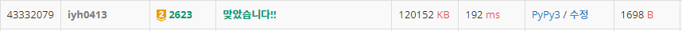

# [Baekjoon] 2623. 음악프로그램 [G2]

## 📚 문제 : [음악프로그램](https://www.acmicpc.net/problem/2623)

## 📖 풀이

**위상정렬** 문제이다.

각 가수마다 자신보다 먼저 나와야하는 가수들의 개수를 찾아 가수들이 다 출연했는지 확인 후 나오도록 순서를 정해준다. `in_degree` 위상 정렬 배열을 선언하고 가수들의 순서를 정해줄 것이다.

- PD들이 정한 순서에 이전에 나올 가수들이 중복될 수 있으므로 가수의 수가 아닌 가수들을 set() 자료형에 담아준다.

2차원 배열의 `graph`에는 각 가수마다 다음에 출연할 가수들을 담아준다.

- PD들이 정한 순서에 이후에 나올 가수들이 중복되므로 set() 자료형을 사용한다.

모든 PD들의 순서에 따라 다 정해준 후 위상 정렬의 set() 자료형을 길이로 값을 바꿔준다.

왜냐면 이제 각 가수들이 나오고 대응되는 가수들의 수만 줄여주면 되니까 굳이 set() 자료형에서 차집합을 사용하지 않고 길이로 바꾼 후 하나씩 빼준다.

BFS를 활용해 위상이 0인 것부터 하나씩 출력한다. 큐에서 가수를 빼면, 그 가수 다음에 나올 가수들의 위상을 1씩 줄여주고, 위상이 0인 가수들을 다시 큐에 담아준다.

이 때 불가능한 경우는 0을 출력해야 하므로 result 배열을 만들어 큐에서 나온 가수들을 순서대로 담는다.

result 배열에 모든 수가 담기지 않으면 0만 출력하고 종료한다. 아니면 result 배열을 언패킹한 후 출력한다.

## 📒 코드

```python
from collections import deque


n, m = map(int, input().split())
graph = [set() for _ in range(n + 1)]       # 현재 가수 다음에 나올 가수들의 집합
in_degree = [set() for _ in range(n + 1)]   # 현재 가수 이전에 나와야 할 가수들의 집합(다 담고 길이로 바꿔줄 예정)

for i in range(m):
    temp = list(map(int, input().split()))      # PD가 정한 순서
    for i in range(1, len(temp)):
        graph[temp[i]] = graph[temp[i]] | set(temp[i + 1:])     # 다음에 나올 가수들 합집합
        in_degree[temp[i]] = in_degree[temp[i]] | set(temp[1:i])    # 이전에 나올 가수들 합집합

que = deque()                   # 순서에 따라 가수들을 담을 큐
for i in range(1, n + 1):
    in_degree[i] = len(in_degree[i])        # 집합을 길이로 바꿔 위상 정렬
    if in_degree[i] == 0:       # 위상이 0인(가장 먼저 나와도 되는 가수) 가수를 먼저 담는다.
        que.append(i)

result = []                     # 순서대로 출력할 result 배열(순서를 정하는게 불가능한 경우를 대비)
while que:
    cur = que.popleft()         # 위상이 0인 가수들을 pop
    result.append(cur)          # result에 가수들을 담아준다.
    for nxt in graph[cur]:      # 현재 가수 이후에 나오는 가수들을 순회
        in_degree[nxt] -= 1     # 다음에 나오는 가수들의 위상을 1씩 줄여준다.
        if in_degree[nxt] == 0: # 위상이 0인 가수들을 큐에 담는다.
            que.append(nxt)

if len(result) != n:            # 불가능한 경우
    print(0)
else:                           # 가능한 경우
    for singer in result:
        print(singer)
```

## 🔍 결과

