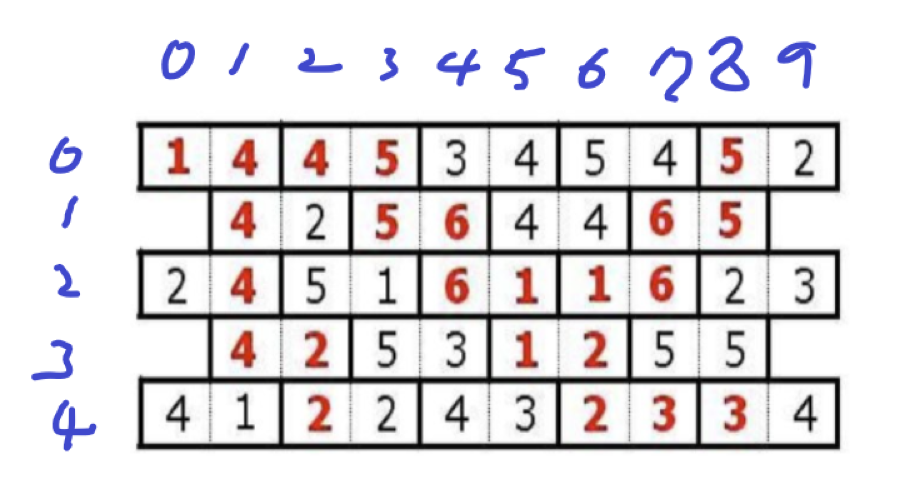
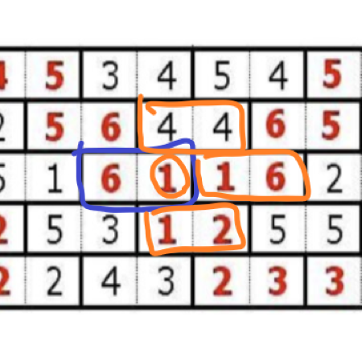
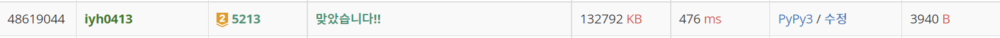

# [Baekjoon] 5213. 과외맨 [G2]

## 📚 문제 : [과외맨](https://www.acmicpc.net/problem/5213)

## 📖 풀이

구현 문제이다.

그래프 문제로 최단거리를 구해야 하니 BFS로 구한다.

타일로 구성되어있으니 n x (n * 2) 의 2차원 배열을 구현해 담아준다.

짝수줄의 양 끝은 0을 담아 주변 타일과 연결되지 않도록 한다.

처음에는 큐에 타일 조각 2개를 묶어서 담지 않고 하나씩 담아 BFS로 푸려고 했다. 그렇게하니 시간초과가 발생해 큐에 타일 조각 2개를 묶어서 담아 시간 초과를 해결했다.

1. 먼저 직사각형이 아닌 타일들을 어떻게 2차원으로 담아줄 지 생각했다.

   짝수 행일 때와 홀수 행일 때가 다르므로 그 때를 구분해주어 담아준다.

   

   위 그림에서 보면 x는 [0 ~ n-1], y는 [0 ~ n*2 - 1]의 범위로 초기화 한다.

   그리고 짝수 행일 때와 홀수 행일 때를 구분하여 담아준다.

   코드로 보면 다음과 같다.

   ```python
   graph = [[0] * n * 2 for _ in range(n)]
   # 타일을 담아주는 방법, 짝수 행일 때와 홀수 행일 때를 구분해서 2차원 배열에 담는다.
   for i in range(n):
       for j in range(n - i % 2):
           t1, t2 = map(int, input().split())
           graph[i][2 * j + i % 2] = t1
           graph[i][2 * j + 1 + i % 2] = t2
   ```

   짝수 행은 [0 ~ n - 1]이고, 홀수 행은 범위를 [1 ~ n - 2]로 좁혀준다.

2. bfs로 타일을 하나씩 이동해나간다.

   bfs에 하나의 타일에 연결된 두 조각을 담는다.

   그러면 [[x1, y1], [x1, y1 + 1]]와 같은 형태로 큐에 넣는다.

   큐에서 오른쪽 조각과 왼쪽 조각으로 나누어 주변 타일들을 확인한다.

   오른쪽 조각부터 그림을 보면 아래와 같다.(파란색이 현재 타일이다.)

   

   오른쪽, 위, 아래 타일들이 인접한 타일들이다. 이 때 인접한 타일 조각들의 왼쪽 부분이랑만 닿아있는 걸 확인할 수 있다. 따라서 인접한 조각의 오른쪽 조각을 함께 큐에 담아준다.

   왼쪽 타일도 마찬가지이다. 인접한 조각이 오른쪽 부분에 닿아 있으니 왼쪽 조각을 함께 큐에 넣어주면 된다.

   똑같은 타일을 또 방문하지 않기 위해서는 어떻게 해야 할까?

3. 확인했던 타일들을 다시 확인하지 않도록 visited 배열을 설정한다.

   visited 배열에 타일을 지난 순서를 적어준다. 이미 적은 횟수로 그 타일에 갔으면 확인하지 않아도 되기 때문이다. 이동할 타일이 현재 타일의 visited 값보다 2이상 큰 수 일 때만 옮겨간다.

   1 크기만 해도 똑같은 순서에다가 이미 확인했던 값이니 또 확인할 필요가 없다.

   더 큰 쪽으로만 움직여야 하므로 처음에 INF 값으로 나올 수 없는 가장 큰 수로 초기화한다.

   타일을 방문 처리할 때 두 조각을 한꺼번에 처리해준다.

4. 마지막 줄의 마지막 타일로 이동할 수 없는 경우가 존재할 수 있다. 이 경우에는 번호가 가장 큰 타일로 이동하면 된다.

   맨 마지막 타일에 도달하지 못할 수 있으니 타일을 뒤부터 확인하며 INF가 아닌 다른 값이 들어갔는지 확인한다. INF가 아니면 도달했을 때이니 그 때의 숫자를 출력하면 된다.

   ```python
   # 도착지 찾기
   def find_destination():
       for i in range(n)[::-1]:
           for j in range(2 * n)[::-1]:
               if visited[i][j] != INF:
                   # 가장 큰 타일까지 방문 횟수와 도착지 타일 번호 리턴
                   return visited[i][j], find_tile_num(i, j)
   ```

   

5. 우리는 타일이 진행된 경로도 출력해야 한다. 따라서 역추적을 해야한다.

   역추적을 하기 위해 타일 번호에 맞춰 이전의 타일 값을 저장해준다. 그러면 우리는 최종적으로 도달한 마지막 타일부터 역으로 어느 경로로 왔는지 확인할 수 있다. 시작점까지 배열에 담아 출력해준다.

   ```python
   # 도착점에서 출발지까지 역추적
   def trace_back(num):
       ans = [num]
       while num:
           num = tiles[num]
           if not num:
               break
           ans = [num] + ans
       return ans
   ```

   

6. 타일 번호를 알기 위한 함수를 하나 만들어야 위 과정을 수월하게 해결할 수 있다. 좌표의 값으로 타일의 번호를 찾는 함수를 만든다.

   ```python
   # 타일의 번호 찾기
   def find_tile_num(x, y):
       # 행 : 짝수 줄 개수 * n + 홀수 줄 개수 * (n - 1)
       cnt_x = (x // 2 + x % 2) * n + (x // 2) * (n - 1)
       # 열 : 짝수 열일 때와 홀수 열일 때 차이 : 짝수 열이면 나머지도 더해준다.
       y += 1
       cnt_y = y // 2 + (y % 2 if x % 2 == 0 else 0)
       return cnt_x + cnt_y
   ```

함정이 많아 모듈화를 깔끔하게 해야 실수 없이 해결할 수 있다.

## 📒 코드

```python
import sys
from collections import deque
input = sys.stdin.readline


def in_range(x, y):
    return 0 <= x < n and 0 <= y < 2 * n


def bfs():
    que = deque()
    # 시작점
    visited[0][0] = 1
    visited[0][1] = 1
    que.append([[0, 0], [0, 1]])  # 큐에 타일을 담는다.(2조각이 한 쌍)

    while que:
        tile_left, tile_right = que.popleft()
        for i in range(4):
            x, y = tile_right   # 오른쪽 타일부터 확인
            nx = x + dx[i]
            ny = y + dy[i]
            if i == 2:          # 왼쪽은 같은 타일이므로 생략
                continue
            if not in_range(nx, ny):                # 범위 확인
                continue
            # 다음 조각의 방문 순서가 더 커야 한다.
            if visited[nx][ny] > visited[x][y] + 1:
                if graph[nx][ny] == graph[x][y]:    # 인접한 두 값이 같은지 확인
                    que.append([[nx, ny], [nx, ny + 1]])
                    # 다른 타일로 이동했으니 방문 횟수를 + 1
                    visited[nx][ny] = visited[x][y] + 1
                    visited[nx][ny + 1] = visited[x][y] + 1
                    # 이동하면 이전 타일 값을 저장
                    tiles[find_tile_num(nx, ny)] = find_tile_num(x, y)
        for i in range(4):
            x, y = tile_left    # 왼쪽 타일 확인
            nx = x + dx[i]
            ny = y + dy[i]
            if i == 0:          # 오른쪽은 같은 타일이므로 생략
                continue
            if not in_range(nx, ny):                # 범위 확인
                continue
            # 다음 조각의 방문 순서가 더 커야 한다.
            if visited[nx][ny] > visited[x][y] + 1:
                # 다른 타일로 이동한 경우
                if graph[nx][ny] == graph[x][y]:    # 인접한 두 값이 같은지 확인
                    que.append([[nx, ny - 1], [nx, ny]])
                    # 다른 타일로 이동했으니 방문 횟수를 + 1
                    visited[nx][ny] = visited[x][y] + 1
                    visited[nx][ny - 1] = visited[x][y] + 1
                    # 이동하면 이전 타일 값을 저장
                    tiles[find_tile_num(nx, ny)] = find_tile_num(x, y)
    cnt, tile_num = find_destination()   # 이동 횟수와 도착지의 타일 번호
    return cnt, trace_back(tile_num)        # 이동 횟수와 경로 리턴


# 타일의 번호 찾기
def find_tile_num(x, y):
    # 행 : 짝수 줄 개수 * n + 홀수 줄 개수 * (n - 1)
    cnt_x = (x // 2 + x % 2) * n + (x // 2) * (n - 1)
    # 열 : 짝수 열일 때와 홀수 열일 때 차이 : 짝수 열이면 나머지도 더해준다.
    y += 1
    cnt_y = y // 2 + (y % 2 if x % 2 == 0 else 0)
    return cnt_x + cnt_y


# 도착지 찾기
def find_destination():
    for i in range(n)[::-1]:
        for j in range(2 * n)[::-1]:
            if visited[i][j] != INF:
                # 가장 큰 타일까지 방문 횟수와 도착지 타일 번호 리턴
                return visited[i][j], find_tile_num(i, j)


# 도착점에서 출발지까지 역추적
def trace_back(num):
    ans = [num]
    while num:
        num = tiles[num]
        if not num:
            break
        ans = [num] + ans
    return ans


n = int(input())
INF = n * 2 * n     # 나올 수 없는 최대 값
dx, dy = [0, 1, 0, -1], [1, 0, -1, 0]   # 우 하 좌 상
graph = [[0] * n * 2 for _ in range(n)]
# 타일을 담아주는 방법, 짝수 행일 때와 홀수 행일 때를 구분해서 2차원 배열에 담는다.
for i in range(n):
    for j in range(n - i % 2):
        t1, t2 = map(int, input().split())
        graph[i][2 * j + i % 2] = t1
        graph[i][2 * j + 1 + i % 2] = t2

# 방문 순서 담기
visited = [[INF] * n * 2 for _ in range(n)]
tiles = [0 for _ in range(n * n + 1)]       # 이전 타일을 저장

cnt, result = bfs()
print(cnt)
print(*result)

```

## 🔍 결과


