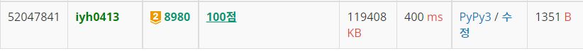

# [Baekjoon] 8980. 택배 [G2]

## 📚 문제 : [택배](https://www.acmicpc.net/problem/8980)

## 📖 풀이

이 문제의 포인트는 받는 마을번호가 보내는 마을번호보다 항상 크다는 것이다.

따라서 낮은 번호의 마을부터 높은 마을 번호로 순서대로 올라가며 확인한다.

시간복잡도를 줄이기 위해 딕셔너리를 활용한다.

heapq를 활용하려 했으나 어차피 최대 최소 2가지를 다 확인해야하므로, 딕셔너리를 정렬해가며 확인했다.


먼저 순차적으로 올라가며 각 마을에서 받을 택배를 딕셔너리에 key는 마을 번호, value는 택배 무게를 넣어준다.

그리고 마을번호를 올라가며 현재 택배 용량을 넘어서면, 담고 있는 택배 중 가장 멀리 가는 택배를 줄여준다.

- 이 때 택배 무게가 용량에 맞게끔 일부만 잘라야 할 수도 있다.

이 과정을 반복하며, 현재 가지고 있는 가장 멀리 가는 택배가 어딘지 체크하며 진행해 나간다.


## 📒 코드

```python
n, c = map(int, input().split())        # n은 동네 수, c는 트럭 최대 적재량
m = int(input())                        # m은 택배 개수
parcels = [[] for _ in range(n + 1)]    # 각 마을에서 보낼 택배 리스트
for i in range(m):
    s, e, cnt = map(int, input().split())       # 출발, 도착, 택배 개수
    parcels[s].append([e, cnt])

last_cap = -1                           # 싣은 택배 중 가장 마지막에 받을 택배
receive_parcels = {}                    # 각 마을에서 받을 택배
cap = 0                                 # 현재 싣고 있는 택배 무게

for i in range(1, n + 1):
    if receive_parcels.get(i):                      # 현재 도착한 택배 조회
        cap -= receive_parcels[i]                   # 도착한 택배 무게를 뺀다.
    for arrive, cnt in sorted(parcels[i]):
        if last_cap <= arrive and cap == c:         # 꽉 찼는데 더 멀리가야하는 경우 종료
            break

        receive_parcels[arrive] = receive_parcels.get(arrive, 0) + cnt
        cap += cnt

        if cap <= c:                                # 새로 넣어도 택배 무게를 넘치지 않는다.
            continue

        receive_parcels_item = sorted(receive_parcels.items())      # 택배 정렬
        while cap > c:                                              # 택배가 더 적어질 때까지 멀리 갈 택배 제거
            arrive, cnt = receive_parcels_item.pop()
            del receive_parcels[arrive]
            cap -= cnt
            if cap < c:                                             # 택배가 더 적어진 경우
                receive_parcels[arrive] = c - cap                   # 택배 무게만큼 다시 채워준다.
                receive_parcels_item.append([arrive, c - cap])
                cap = c
        last_cap = receive_parcels_item[-1][0]         # 담겨있는 택배 중 가장 멀리 갈 택배 마을 번호를 담는다.

print(sum(receive_parcels.values()))
```

## 🔍 결과

