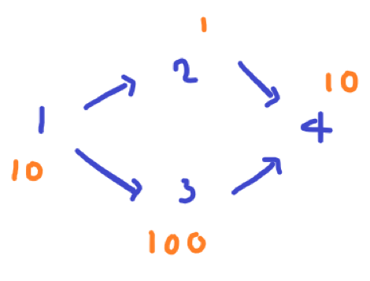
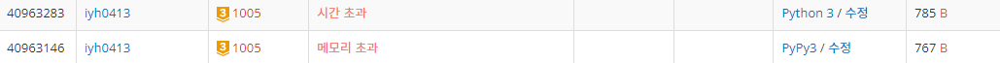
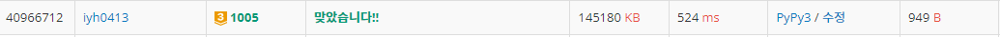

# [Baekjoon] 1005. ACM Craft [G3]

## 📚 문제

https://www.acmicpc.net/problem/1005

---

## 📖 풀이 - BFS(역추적)  Fail

예제를 보며 어떤 형식으로 풀어야 할지 생각한다.

- Input

```
4 4
10 1 100 10
1 2
1 3
2 4
3 4
```

그림으로 그려보면



찾을 노드부터 역추적하면서 최대값을 찾는다. 같은 노드로 이어지는 경우 더 큰 값을 넣고 다음 간선을 탐색한다.

## 📒 코드 - BFS(Fail)

```python
from collections import deque
import sys
input = sys.stdin.readline

for tc in range(int(input().rstrip())):
    n, k = map(int, input().split())
    arr = [0] + list(map(int, input().split()))
    graph = [[] for _ in range(n + 1)]  # 건설 순서의 반대를 넣어준다!!
    for _ in range(k):
        s, e = map(int, input().split())
        graph[e].append((s, arr[s]))
    w = int(input().rstrip())
    queue = deque()
    queue.append((w, arr[w]))                 # 노드와 그 때 걸린 시간
    time = arr[w]                             # 총 소요 시간
    del arr
    while queue:
        v, t = queue.popleft()
        for v2, t2 in graph[v]:
            t2 = max(t + t2, t2)
            time = max(time, t2)
            queue.append((v2, t2))
    print(time)
```

## 🔍 결과  : Fail



python으로는 시간초과, pypy로는 메모리초과가 발생한다.

위 처럼 푸는 경우 문제점이 한 노드에 여러 노드를 거치는 횟수가 다른 간선들이 존재하면 필요 없이 중복 계산하는 경우가 발생한다.

위상정렬로 우선순위를 매겨 해결하면 된다고 한다.

따라서 처음부터 위상정렬을 통해 우선순위를 매겨 풀도록 한다.

---

## 📖 풀이 - 위상 정렬

### 위상 정렬(Topological sort)

순환하지 않는 그래프에서 정점을 선형으로 정렬하는 것!!

선수과목 문제는 보통 위상정렬로 해결한다. -> 사이클이 없는 경우만 가능하다~

먼저 정점에 들어오는 간선의 개수를 적어준다. => 이것이 위상!!

간선이 없으면 위상이 0이니 위상이 0인 것부터 처리하는 것이다. 따라서 위상정렬이 DP 역할을 하는 것이다.

BFS로 위상이 0인 정점들을 큐에 담아 해결한다.

정점을 큐에서 꺼내 간선으로 연결된 정점들에 현재 값을 더한 최대값으로 경신한다.

따라서 최대값으로 계속 바꿔줘야하니 배열을 하나 더 선언해서 값을 넣어줘야 한다.

간선을 해결하면 그 간선을 지워준다. 연결된 정점의 위상을 하나 줄여주면 된다!

나는 dp 배열을 선언해 `[:]`슬라이싱으로 입력으로 들어온 배열을 복사해서 사용했다.

간선이 다 없어진 정점들을 다시 큐에 담는다.

이 과정을 반복하다가 큐에 w가 나오면 종료한다.

## 📒 코드

```python
from collections import deque
import sys
input =  sys.stdin.readline

for tc in range(int(input().rstrip())):
    n, k = map(int, input().split())
    arr = [0] + list(map(int, input().split()))
    in_degree = [0 for _ in range(n + 1)]       # 들어오는 간선의 개수를 적어준다.
    graph = [[] for _ in range(n + 1)]  # 건설 순서의 반대를 넣어준다!!
    for _ in range(k):
        s, e = map(int, input().split())
        graph[s].append(e)
        in_degree[e] += 1
    w = int(input().rstrip())
    queue = deque()
    for i in range(1, len(in_degree)):      # 위상이 0인 것을 큐에 담아준다.
        if in_degree[i] == 0:
            queue.append(i)
    dp = arr[:]         # 간선에 들어오는 최대값으로 갱신해줄 값
    while queue:
        v = queue.popleft()
        if v == w:      # 원하는 w가 나오면 종료
            break
        for node in graph[v]:
            dp[node] = max(dp[node], arr[node] + dp[v])     # 최대값으로 갱신
            in_degree[node] -= 1
            if in_degree[node] == 0:    # 들어오는 간선을 다 처리해주면 큐에 넣는다.
                queue.append(node)
    print(dp[w])
```

## 🔍 결과



우선 순위가 존재하는 트리문제는 위상정렬을 통해 해결하도록 한다!!