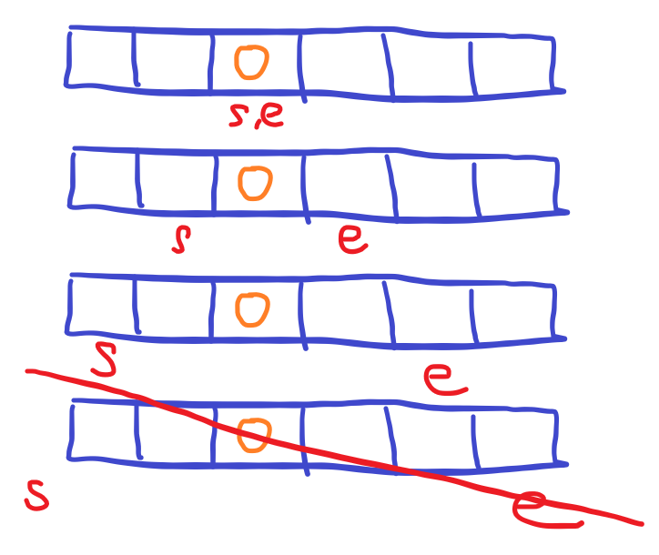
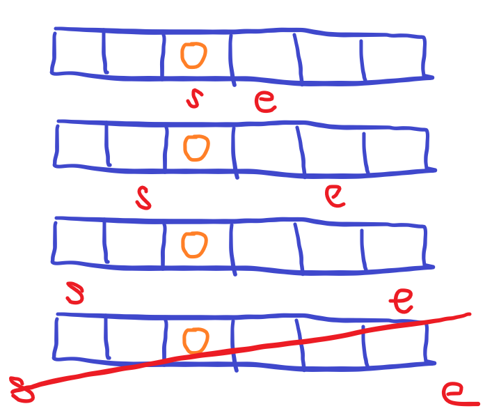

# [Baekjoon] 10942. 팰린드롬? [G3]

## 📚 문제

https://www.acmicpc.net/problem/10942

---

수열의 크기는 2000이고 질문의 개수는 100만 개이다. 따라서 팰린드롬인지 판단하여 2차원 배열에 다 담고 질문에 대한 답을 출력하면 된다.

팰린드롬인지 빨리 확인하는 방법은??

내가 생각한 방법은 mid값을 정하고 좌우로 넓혀가며 팰린드롬인지 판단하는 것이다.

중간에 팰린드롬이 아니면 종료한다.

홀 수일 때와 짝 수일 때를 나눠서 생각할 수 있다.

먼저 홀수일 경우를 그림으로 그려보면 다음과 같다.



mid를 모든 첫 인덱스부터 끝 인덱스까지 확인하며 찾아줘야 한다.

위 그림은 mid가 2일 때이다.(첫 인덱스를 0이라고 하자)

그러면 입력받은 배열을 arr이라고 하면, arr[s]와 arr[e]가 같으면 팰린드롬인지 넣어줄 배열에 1을 넣어준다.

팰린드롬 배열을 pallin으로 만들었는데 `pallin[s][e]`에 1을 넣어주면 된다.

중간에 arr[s]와 arr[e]가 달라지면 mid를 중심으로 더 이상 팰린드롬이 나올 수 없으므로 종료한다. 그리고 인덱스를 s나 e가 하나라도 배열의 크기를 넘어가면 종료한다.

이걸 모든 인덱스에서 확인한다.

짝수일 때를 보면



e를 s의 한 칸 앞에 놓는다.

그리고 홀 수일 때와 똑같이 구한다.

그런다음 값을 넣어주면 된다.

DP를 활용하는 방법이 정석적인 풀이인데 나는 위와 같이 풀어서 해결했다.

## 📒 코드

```python
import sys
input = sys.stdin.readline

n = int(input())
arr = list(map(int, input().split()))
palin = [[0] * n for _ in range(n)]     # 팰린드롬의 결과를 담을 배열
for i in range(n):          # 홀수일 때, i를 중심으로 한 칸씩 넓혀가며 팰린드롬인지 파악
    s = i
    e = i
    while s >= 0 and e < n:
        if arr[s] != arr[e]:    # 팰린드롬이 아니면 종료, i를 중심으로 하는 이후 값들도 무조건 팰린드롬이 아니다.
            break
        palin[s][e] = 1         # 팰린드롬이면 값을 넣어준다.
        s -= 1                  # 한 칸씩 양쪽으로 넓힌다.
        e += 1
for i in range(n):          # 짝수일 때, i + 0.5를 중심으로 한 칸씩 넓혀가며 팰린드롬인지 파악
    s = i
    e = i + 1
    while s >= 0 and e < n:
        if arr[s] != arr[e]:    # 팰린드롬이 아니면 종료
            break
        palin[s][e] = 1
        s -= 1                  # 한 칸씩 양쪽으로 넓힌다.
        e += 1
m = int(input())
for _ in range(m):
    s, e = map(int, input().split())
    print(palin[s - 1][e - 1])      # padding을 따로 넣지 않고 1씩 빼준 후 출력
```

## 🔍 결과

