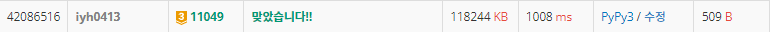

# [Baekjoon] 11049. 행렬 곱셈 순서 [G3]

## 📚 문제

https://www.acmicpc.net/problem/11049

---

## 📖 풀이

500개까지 행렬이 주어질 수 있다.

모든 순서를 확인하면 499!까지 나오니 시간 안에 불가능하다.

따라서 **dp**, 메모이제이션을 활용한다. 메모이제이션으로 이차원 행렬을 만든다.

입력으로 받은 행렬을 순서대로 담고, i번째 행렬부터 j번째 행렬까지의 곱셈 연산 횟수의 최솟값을 `dp[i][j]`에 저장한다.

i와 j의 차이가 작은 값부터 채운다.

ABCD를 만드는 경우를 생각해보면,

>`A*(BCD)`
>
>`(AB)*(CD)`
>
>`(ABC)*D`

세가지로 나누어서 생각할 수 있다.

각각 두 개의 묶음으로 나눌 수 있다. 둘로 나누니 앞에 조합을 X, 뒤를 Y라고 한다.

첫번째 경우는 `X = A`, `Y = BCD`이고, 두번째 경우는 `X = AB`, `Y = CD`이다.

따라서 최종적으로 구하는 값은

모든 X, Y 중 `X 만드는 최소값 + Y 만드는 최소값 +  X의 시작값 * X의 끝값(Y의 시작값) * Y의 끝값` 중 최소 값이다.

|      | 5x3  | 3x2  | 2x6  | 6x4  |
| ---- | ---- | ---- | ---- | ---- |
| 5x3  | 0    | 30   | 90   | 118  |
| 3x2  |      | 0    | 36   | 72   |
| 2x6  |      |      | 0    | 48   |
| 6x4  |      |      |      | 0    |

위와 같이 구할 수 있다.

## 📒 코드

```python
def recur(a, b):
    if dp[a][b] != -1:
        return dp[a][b]
    
    ret = 2 ** 31
    for i in range(a, b):
        ret = min(ret, recur(a, i) + recur(i + 1, b) + arr[a][0] * arr[i][1] * arr[b][1])
    dp[a][b] = ret
    return ret

n = int(input())
arr = [list(map(int, input().split())) for _ in range(n)]
dp = [[-1] * n for _ in range(n)]   # [a, b] 까지 중 곱셈 연산 횟수의 최솟값
for i in range(n):  # [i, i]는 행렬이 하나이므로 0이다.
    dp[i][i] = 0
print(recur(0, n - 1))
```

## 🔍 결과

