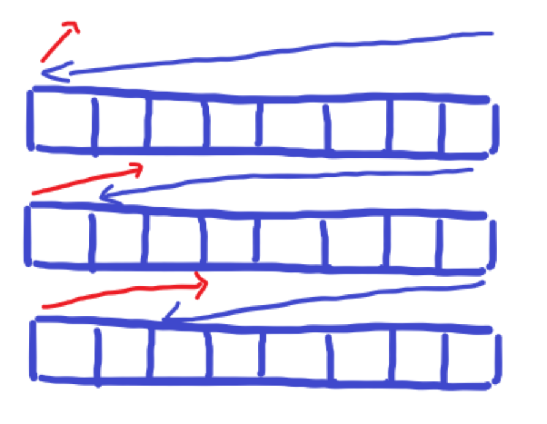
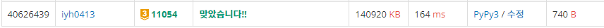

# [Baekjoon] 11054. 가장 긴 바이토닉 부분 수열 [G3]

## 📚 문제

https://www.acmicpc.net/problem/11054

---

## 📖 풀이

> 수열 S가 어떤 수 Sk를 기준으로 S1 < S2 < ... Sk-1 < Sk > Sk+1 > ... SN-1 > SN을 만족한다면, 그 수열을 바이토닉 수열이라고 한다.

LCS를 풀었던 방법을 활용한다.

숫자의 순서를 비교해야하니 이 때 DP의 인덱스는 숫자의 값이다.

DP를 증가하는 방향이랑 감소하는 방향 두 가지를 만든다.

증가하는 방향은 입력된 문자열 앞에서부터 적용시켜준다.

감소하는 방향은 입력된 문자열의 뒷부분부터 적용한다.

그림으로 설명하면 다음과 같다.



다음과 같이 특정 인덱스 기준 왼쪽부터 인덱스까지의 증가량의 최댓값과, 오른쪽에서 인덱스까지 감소량의 최댓값을 구해 더한다. 각 인덱스마다 구한 결과 중 최댓값을 출력한다.

이 때, 주의할 점은 배열을 돌면서 인덱스를 하나씩 검색해야 한다. 빨간 선은 처음부터 순차적으로 수행할 수 있지만, 파란 선은 마지막에 수행해야한다. 따라서 파란색도 끝 인덱스부터 시행해주어 반복을 줄인다.

같은 인덱스가 한 번 반복되므로 1을 빼준다.

배열을 돌며 같이 수행한다.

---

예제로 확인한다.

- input

```
10
1 5 2 1 4 3 4 5 2 1
```

들어오는 입력을 dp의 열에 각각 연결된다.

왼쪽은 증가하는 방향이고 오른쪽은 감소하는 방향이다.

왼쪽은 첫 번째 인덱스부터, 감소하는 방향은 끝 인덱스부터 탐색한다.

| 증가 | 1    | 2    | 3    | 4    | 5    |      | 감소 | 1    | 2    | 3    | 4    | 5    |
| ---- | ---- | ---- | ---- | ---- | ---- | ---- | ---- | ---- | ---- | ---- | ---- | ---- |
| 1    | 1    | 1    | 1    | 1    | 1    |      | 1    | 1    | 1    | 1    | 1    | 1    |
| 5    | 1    | 1    | 1    | 1    | 2    |      | 2    | 1    | 2    | 2    | 2    | 2    |
| 2    | 1    | 2    | 2    | 2    | 2    |      | 5    | 1    | 2    | 2    | 2    | 3    |
| 1    | 1    | 2    | 2    | 2    | 2    |      | 4    | 1    | 2    | 2    | 3    | 3    |
| 4    | 1    | 2    | 2    | 3    | 3    |      | 3    | 1    | 2    | 3    | 3    | 3    |
| 3    | 1    | 2    | 3    | 3    | 3    |      | 4    | 1    | 2    | 3    | 4    | 4    |
| 4    | 1    | 2    | 3    | 4    | 4    |      | 1    | 1    | 2    | 3    | 4    | 4    |
| 5    | 1    | 2    | 3    | 4    | 5    |      | 2    | 1    | 2    | 3    | 4    | 4    |
| 2    | 1    | 2    | 3    | 4    | 5    |      | 5    | 1    | 2    | 3    | 4    | 5    |
| 1    | 1    | 2    | 3    | 4    | 5    |      | 1    | 1    | 2    | 3    | 4    | 5    |

맨 윗 줄부터 시작하며, 입력받은 숫자는 배열의 왼쪽 위 값에 1을 더해주고, 나머지는 왼쪽과 위의 값 중 큰 값으로 골라 적는다. 1이나 맨 위 인덱스를 해결하기 위해 바깥쪽으로 0(padding)을 설정해주고 풀면 쉽다.

오른쪽 dp는 거꾸로 구한 결과이다.

거꾸로 구한 결과이니 뒤집어서 합해준다.

왼쪽은 결과가 `[1, 2, 2, 2, 3, 3, 4, 5, 5, 5]`이고 오른쪽은 결과를 뒤집으면 `[5, 5, 4, 4, 4, 3, 3, 3, 2, 1]`이다.

두 결과를 각각 합하면 `[6, 7, 6, 6, 7, 6, 7, 8, 7, 6]`이다.

이 결과가 각 인덱스를 가장 큰 수로 하는 바이토닉 부분 수열의 최대 길이이다. 인덱스의 값이 중복되니 가장 큰 값에서 1을 빼 출력한다.

## 📒 코드

```python
n = int(input())
arr = [0] + list(map(int, input().split()))
m = max(arr)
dp_f = [[0] * (m + 1) for _ in range(n + 1)]    # 증가하는 방향
dp_b = [[0] * (m + 1) for _ in range(n + 1)]    # 감소하는 방향

for i in range(1, n + 1):
    for j in range(1, m + 1):
        # dp 증가하는 방향
        if j == arr[i]:
            dp_f[i][j] = dp_f[i-1][j-1] + 1
        else:
            dp_f[i][j] = max(dp_f[i][j-1], dp_f[i-1][j])
        # dp 감소하는 방향
        if j == arr[-i]:
            dp_b[i][j] = dp_b[i-1][j-1] + 1
        else:
            dp_b[i][j] = max(dp_b[i][j-1], dp_b[i-1][j])

max_result = 0
for i in range(1, n + 1):
    max_result = max(max_result, dp_f[i][-1] + dp_b[-i][-1])

print(max_result - 1)
```

## 🔍 결과

