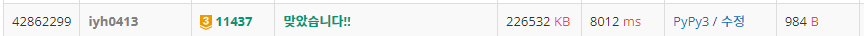
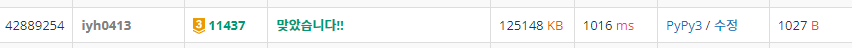

# [Baekjoon] 11437. LCA [G3]

## 📚 문제 : [LCA](https://www.acmicpc.net/problem/11437)

---

## 📖 풀이

가장 가까운 공통 조상을 구하는 문제이다.

여러가지 구상으로 해결해보려고 했다.

1. 각 노드마다 부모를 저장한다. 두 노드의 부모를 확인해야할 때 각 노드의 부모들을 순서대로 리스트에 저장하여 비교해주었다.

   재귀함수로 호출하려고 하니 시간초과가 발생한다.

2. 각 노드마다 부모들을 다 리스트에 순서대로 저장하면 메모리초과가 발생한다.

3. 1번 방법대로 부모를 저장한 후, 각 부모들을 반복문으로 호출하여 시행하니 시간이 오래 걸렸지만 겨우 돌아갔다.

## 📒 코드(시간이 많이 걸린 코드)

```python
from collections import deque
import sys
input = sys.stdin.readline


n = int(input())
par = [0 for _ in range(n + 1)]
graph = [[] for _ in range(n + 1)]

for i in range(n - 1):
    a, b = map(int, input().split())
    graph[a].append(b)
    graph[b].append(a)

par[1] = 1  # 루트
que = deque()
que.append(1)
while que:
    v = que.popleft()
    for node in graph[v]:
        if par[node]:
            continue
        par[node] = v
        que.append(node)

m = int(input())
for i in range(m):
    a, b = map(int, input().split())
    arr_a = [a]
    arr_b = [b]
    while True:
        arr_a.append(par[a])
        if par[a] == 1:
            break
        a = par[a]
    while True:
        arr_b.append(par[b])
        if par[b] == 1:
            break
        b = par[b]
    arr_a = arr_a[::-1]
    arr_b = arr_b[::-1]
    result = 0
    for i in range(min(len(arr_a), len(arr_b))):
        if arr_a[i] != arr_b[i]:
            break
        result = arr_a[i]
    print(result)
```

## 🔍 결과



---

[나동빈님 유튜브 영상 참고](https://www.youtube.com/watch?v=O895NbxirM8)을 보고 시간을 줄일 방법을 생각해보았다.

**depth**가 포인트이다.

각 노드 별로 depth를 다 구한다.

두 노드의 공통 조상을 구할 때, 노드의 depth를 작은 쪽에 맞춘다. 어차피 하나의 depth가 3이고 다른 하나는 5이면 depth가 4, 5일 때의 값은 답이 될 수 없다. 따라서 depth가 작은 쪽에 맞게 큰 depth인 노드를 부모로 depth가 같을 때까지 거슬러올라간다.

depth가 같아지면 그 때부터 비교를 해나가면서 확인한다.

## 📒 코드

```python
from collections import deque
import sys
input = sys.stdin.readline


def lca(a, b):
    while depth[a] != depth[b]:     # depth가 같아지게
        if depth[a] > depth[b]:
            a = par[a]
        else:
            b = par[b]

    while a != b:       # 공통 조상인지 확인
        a = par[a]
        b = par[b]
    return(a)


n = int(input())
graph = [[] for _ in range(n + 1)]  # 각 노드의 연결 관계

for i in range(n - 1):
    a, b = map(int, input().split())
    graph[a].append(b)
    graph[b].append(a)      # 양방향 그래프

par = [0 for _ in range(n + 1)]     # 각 노드의 부모를 저장
depth = [0 for _ in range(n + 1)]   # 각 노드의 depth를 저장
par[1] = 1  # 루트의 부모노드는 없지만 확인됐음을 표시!!
que = deque()
que.append(1)
while que:      # bfs
    v = que.popleft()
    for node in graph[v]:
        if par[node]:       # 아직 확인되지 않는 노드인 경우만
            continue
        par[node] = v       # 루트부터 각 노드의 부모 노드를 저장
        depth[node] = depth[v] + 1      # 각 노드의 depth를 저장
        que.append(node)    # 다음 depth를 확인

m = int(input())
for _ in range(m):
    a, b = map(int, input().split())
    print(lca(a, b))
```

## 🔍 결과


